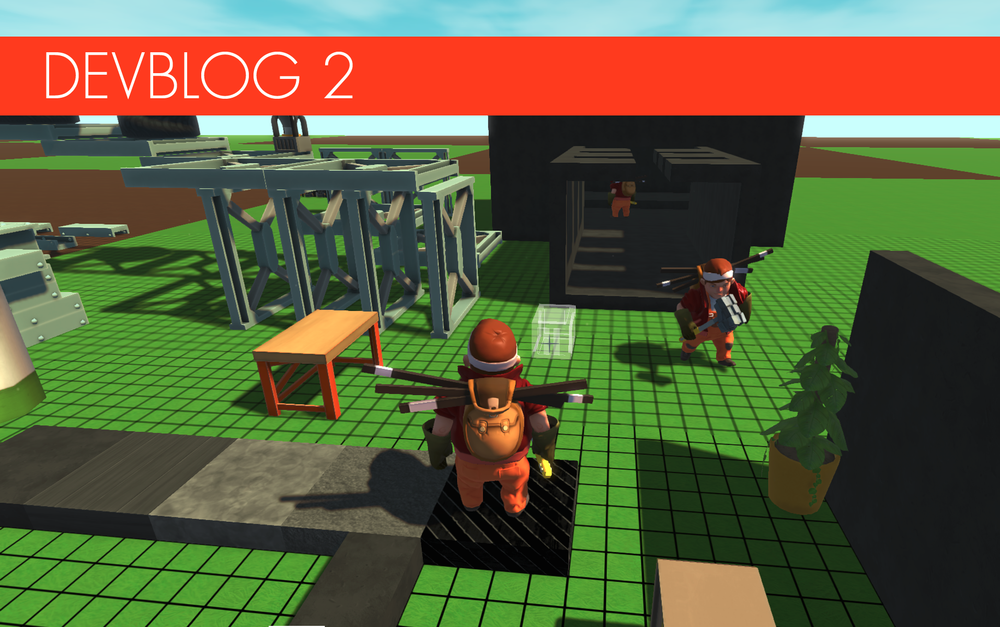
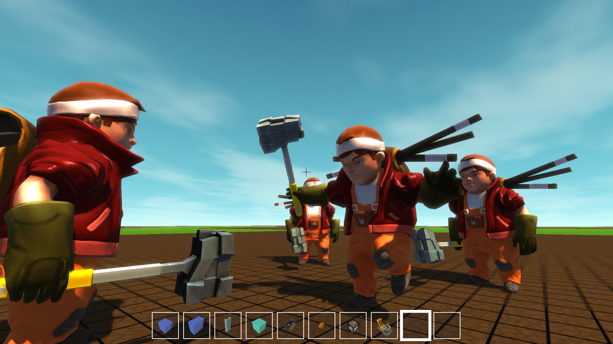
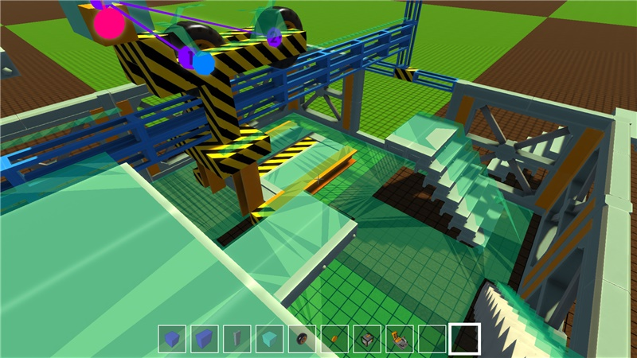
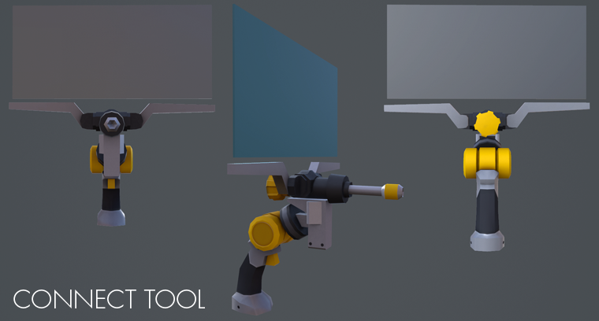
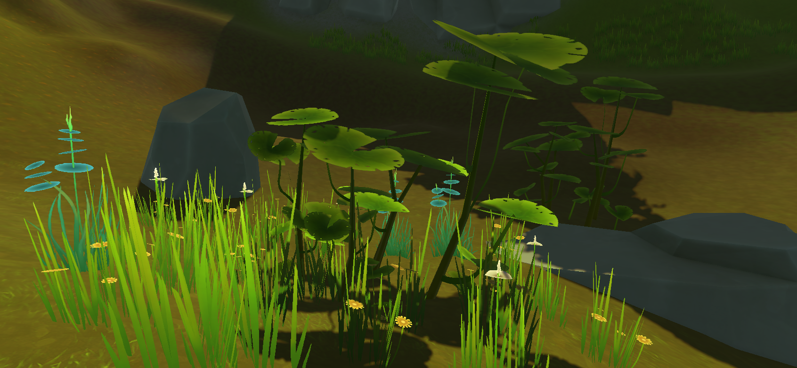
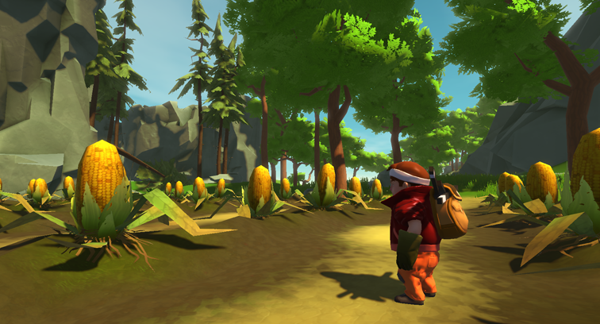
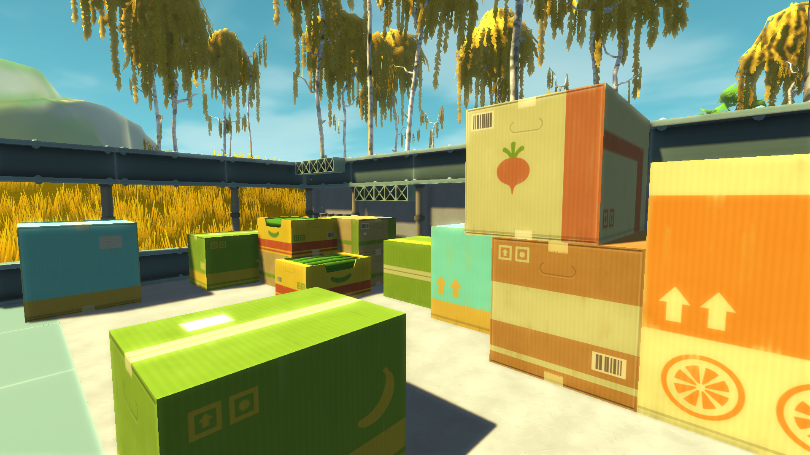

<head>
    <meta name="twitter:card" content="summary_large_image" />
</head>

**Hi Mechanics!**

It's just about time for another update! We can report that we've made
some great progress this month, with plenty of exciting stuff to share
with you.
<!--truncate-->

#### First Steps in Multiplayer!

Humans. Homo sapiens. Social animals by nature, most of us enjoy the
joy-inducing benefits of friendship. Do you have a friend? Imagine
that friend. Imagine gathering scrap with your friend. Then imagine
building amazing vehicles with your friend and driving on a scrap
hunting adventure together exploring the world with your Very! Own!
Friend! We just had to make that happen, which is why we've been
working double hard on the multiplayer feature of Scrap Mechanic. It's
not fully cooked yet, but we're getting there. Here is a screenshot
from our most recent multiplayer test session. Should really have
called it a multiplayer troll session though. It was a lot of fun!

#### Infecting the Enemy AI with Actual Rage...

Gustav and Alex have been working on the enemy AI and have made some
superb progress on their navigation. Even if you build an especially
tricksy structure, we're obviously twisted enough to want your enemy
to still find a path to reach you, unsettle you and delight in
watching you attempt to adjust your lifestyle to accommodate pain,
confusion and moderate despair. We're looking forward to seeing if
you'll be able to outsmart our AI.

#### Connect Tool Tweaks

We've re-designed the connect tool by making it more thick and bulky
so that it fits our art direction better. This tool is really
important when building moving creations, letting you hook everything
up, like engines and bearings for example.

#### Turning Over a New Leaf

This month has been all about leaves. We've added so many new terrain
props that you could easily assemble them into a truly wonderful
salad, but in the absence of digital vinaigrette, we've decided to
plant these fantastic flowers and bushes instead. Sitting pretty in
the ground, they're now doing a great job of making the world look
more beautiful while we keep stepping up the hard visual work to
include fields - home to these giant corn plants!

#### Thinking Outside the Box

We've added a bunch of new fruit and veg crates that you'll be able to
use and build with. We're pretty pleased with how they're looking, and
we feel like they really fit the world nicely. Some of the team have
had dreams about being able to build cars out of cucumber boxes, and
whilst we're delighted to have made this a reality, we're worried
about where their thoughts are taking them at night. Don't forget to
build your own cucumber box car at the earliest opportunity!

#### Beautiful Main Menu

We're entering the last phase of getting the main menu all done and
dusted. The groundbreaking features 'Create New Game', and 'Continue
Saved Game' are now in place, and we're waiting for the award
nominations in the mail. The settings are all where they should be and
it's now possible to quit the game without using the task manager.
Yeah, we know. We'll get you a picture once it's all 100% done. Brace
yourself for one beautiful menu!

<iframe
  src="https://www.youtube.com/embed/TRavpZqkNcc"
  frameBorder="0"
  allow="accelerometer; autoplay; clipboard-write; encrypted-media; gyroscope; picture-in-picture"
  allowFullScreen
  style={{ aspectRatio: '16/9', width: '100%' }}
/>

#### Introduction Video

If you follow us on Facebook or Twitter you might already have seen
our latest video introducing the Gas Engine and the Driver's Seat.

If you have any requests or suggestions, feel free to contact us via
Facebook or Twitter We love hearing from all you future Mechanics!