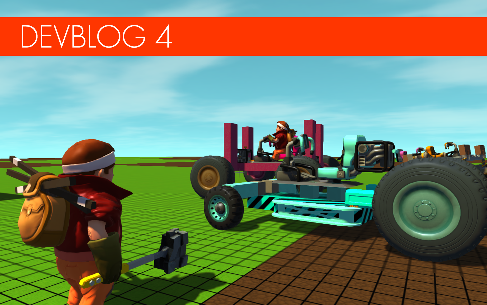
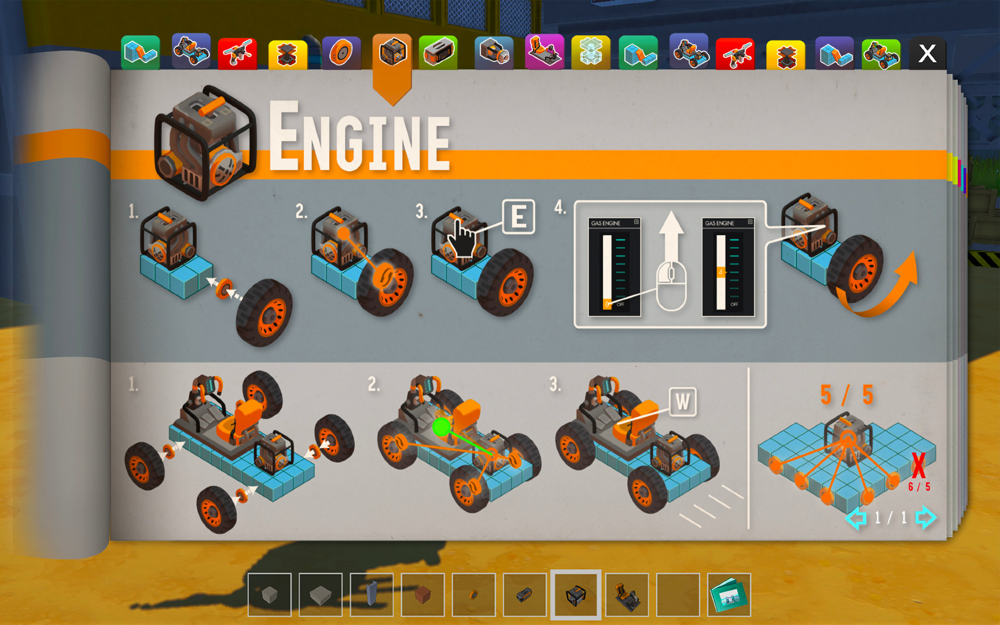
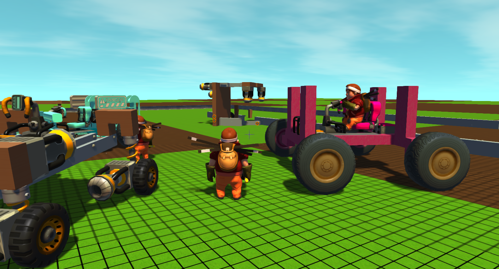
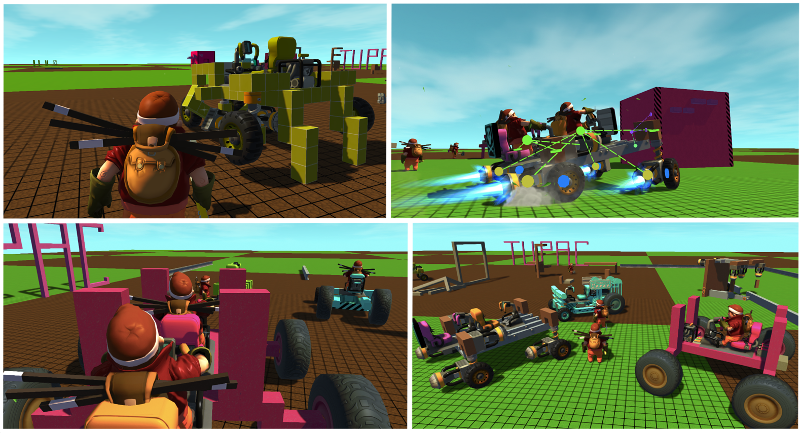
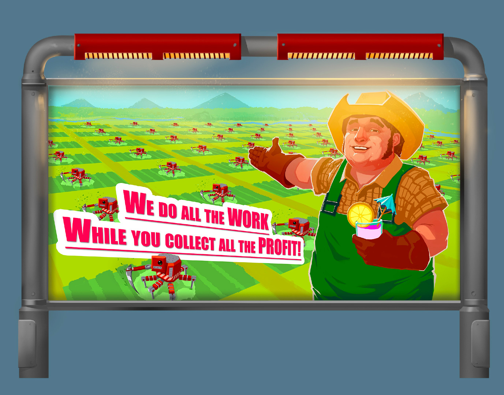
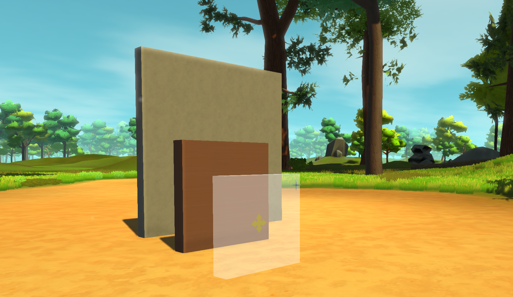
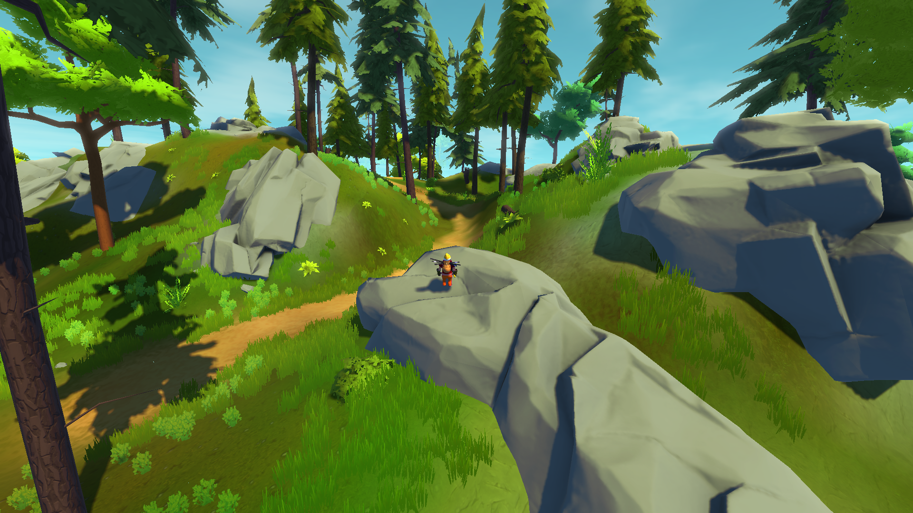
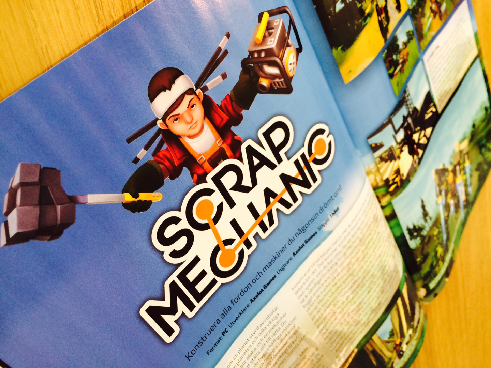

<head>
    <meta name="twitter:card" content="summary_large_image" />
</head>

<!--truncate-->

**Hey Mechanics!**

We've been exceptionally productive in the last few weeks, with loads
of good progress! Right now, we're basically trying to wrap up
everything we have so far, but - being the insane perfectionists we
are - we just can't stop ourselves from adding new things here and
there. As always, we have some awesome stuff to share with you today!

#### Mechanics' Handbook: All the Answers!

It's safe to say that nobody really enjoys lengthy tutorials, and
we're sure you've all come to expect that we're far from dull.
Teaching all you mechanics how to operate all the powerful tools in
one go would be a bit too much. Kind of like working towards some kind
of horrifyingly boring qualification in how to be bored. In order to
avoid this we needed a solution that helps the player learn at a good
pace, and preferably without breaking immersion. We've spent many
sleepless nights crying, trying to come up with the best solution, and
when we finally got to sleep we had some serious nightmares, but now -
and with 73.8% less hair - we think we might have found a nice
approach. The solution is the Mechanics' Handbook! Beautifully
illustrated with simple step-by-step drawings, the Mechanics' Handbook
will teach the player how things work. Every mechanic will start the
game with the handbook in their inventory, ready to be flipped through
and learned from at any time. We hereby announce the tragic passing of
boring tutorials.

#### Cruise Around with Your Friends

We're thrilled to let you know that we've made heaps of awesome
progress on our multiplayer features since last time. You can now
build a car so impressive that it will make your friends green with
envy. Well worry not, as you'll be able to cheer them up by sharing
the wealth and taking them along for the ride. There have been more
than just a few intense races lately at Scrap Mechanic HQ. It's fun to
build vehicles and then take them for a race against friends to see
who's vehicle is the best.

#### We're Adding Ads! But not Like That...

Since no big company is willing to pay us a ton of money for
advertising in the game, we decided to take it into our own hands and
make some awesome ads that go hand in hand with the world and the
story. What's happened on this planet? These ads sure give a curious
little window into the past. Check out this glorious in game ad
passionately executed by our artist Robin. Hunt down more awesome ads
and signs in the game!

#### Base Materials Have Landed!

We've been making some pretty significant improvements to the building
system... Yeah, you heard! The game isn't even out yet and we're already
making changes and improvements! We've added a whole new type of
object: something we call 'base materials'. These are pure materials
like stone, wood or metal to name just a few. Instead of placing down
a single piece, these materials can be scaled from a small block right
through to a massive wall, which is fantastic for creating big
structures like a building. You can now build your very own dream
house with ease in Scrap Mechanic, just don't forget to send us an
invitation to the housewarming!

#### Rocks Revisited

We were never too happy with how some of the rocks were looking. They
were a bit too edgy and minimalistic for our liking, so we decided to
give them some extra love this month. We've seasoned them up nicely
with a pinch of normal maps and then baked the shadows nicely so they
get that beautiful gradient. Our lead artist Adrian is a true
Masterchef!

#### Scrap Mechanic in Print!

We're delighted to share with you our first print magazine feature!
The awesome guys at Swedish magazine 'Robot' got the chance to visit
Scrap Mechanic HQ and play the game! (HQ sounds glamorous, but it's
really only a pretty small room.) One quote from the article jumped
out at us, "the machines you can construct in this game are infinitely
more awesome then anything we've built in Minecraft" ...Now that's a
pretty big compliment! The magazine is out in Sweden and in the UK.
Massive thanks to the Robot guys for giving Scrap Mechanic a whole
spread.

<iframe
    title="Introducing the Thruster"
    src="https://www.youtube.com/embed/GUBjeBUnwPI"
    frameBorder="0"
    allow="accelerometer; autoplay; clipboard-write; encrypted-media; gyroscope; picture-in-picture"
    allowFullScreen
    style={{ aspectRatio: '16/9', width: '100%' }}
/>

#### Introducing the Thruster!

If you follow us on Facebook or Twitter you might already have seen
our latest video introducing the Thruster. If not, check it out!
