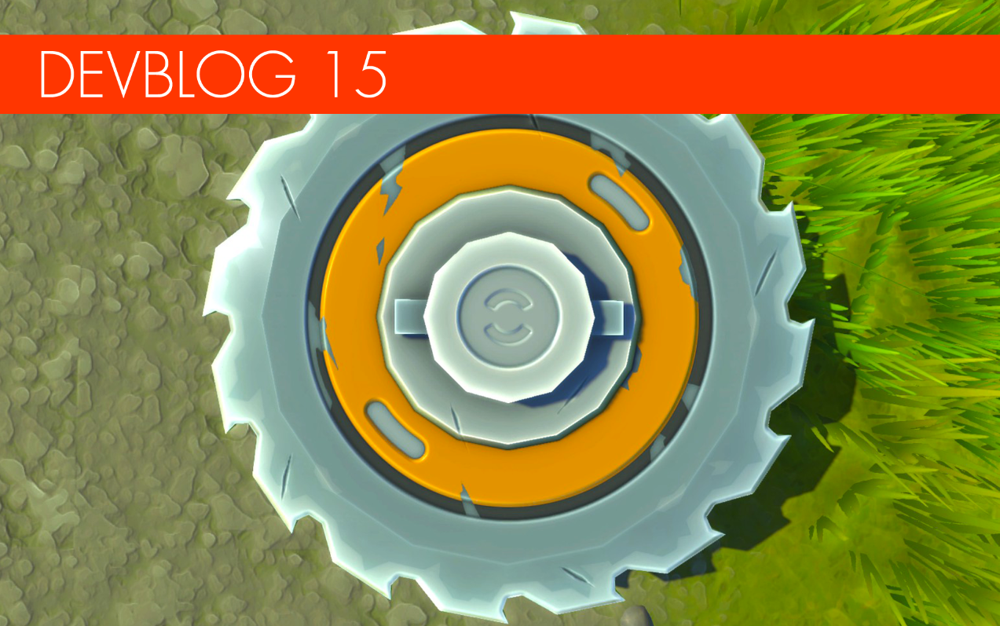

<head>
    <meta name="twitter:card" content="summary_large_image" />
</head>

**Greetings, Mechanics!**

The chime of your doorbell announces the arrival of our latest, delicious Scrap Mechanic devblog, hot and spicy from our development oven.
Our expert chefs have prepared this one with extra special care, and we think you'll agree we've supplied some tasty toppings indeed! 
<!--truncate-->

#### The Saw Blade

Let's kick things off with a cutting-edge announcement: One of our original goals for Scrap Mechanic was to make tree and rock gathering fun and satisfying - which proved just as difficult as that sounds - while also encouraging creative thinking from players.
For example, how best can mechanics prevent the tree they've just chopped down from smashing onto their fancy new creation? How do you then transport that tree to the refinery without the need for a gigantic truck? 
These are just some of the things Mechanics will have to keep in mind when building your resource gathering vehicle. But none of these vehicles will be complete without the new interactive part, the Saw Blade! 
Place the Saw Blade on a bearing, crank the engine up to max and aim for a tree or rock to slice it like a pepperoni pizza. It will look a lot better when it's completely done. 
We also hear that Farmbots are not big fans of these blades... But more on that later!

#### Shake the Room

With the first breed of Spud guns in the wild, with their awesome-but-limited ability to annihilate single blocks, it's time to introduce you to something a bit more... explosive. Say hello to the ultra-destructive Explosive Canisters!
Freshly transferred from Survival to Creative Mode, these fragile boom-tanks make destruction even more fun and satisfying. 
The Canisters come in two different sizes, with each dealing a different amount of damage. They explode from either being hit by a spud gun or by being thrown or dropped from different heights. 
Another interesting feature to note is how the Explosive Canisters deal different amounts of damage to different blocks. For example, a metal block will not receive as much damage as a wooden block. This is our first introduction of material damage.
Important note: Please make sure you save your creations before playing with these dangerous toys! There won't be much left if they go off near your lovely new toy... especially if they're chained! 
We hope to add these to Creative mode in the next update. Boom!

 

#### Challenge mode

Yep, that's right! We're delighted to announce the introduction of a brand new mode for 
Scrap Mechanic: Challenge mode! 
Sometimes when the team is tinkering away with the ambitious mothership that is Survival, we often discover that parts of its code are good enough to be used in more ways than one, creating entirely different game modes from mostly the same amount of work.
One such discovery recently resulted in the creation of Challenge Mode, a series of bite-size trials for players to test their skill and creativity.
Each challenge starts by giving the player a few parts from a chest. You'll then be tasked with building something with said parts to overcome an obstacle, such as pushing a large ball through a maze without losing it. These challenges will separate the mechanics from the... erm, non-mechanics.
It will also be possible for modders to create and upload their own Challenges for other players to try, or even entirely new gameplay modes. It's an exciting addition that we think demonstrates the smart approach we're trying to take with the development of Scrap Mechanic... and it's a lot of fun too!

 

#### Open World Roads

Here at Scrap Mechanic HQ, we're not afraid of taking on a difficult and often impossible challenge and our latest impossible mission has resulted in one of our proudest features yet.
After much toil and moil, our team of engineers have managed to create a system that creates totally randomly generated roads in Survival terrain, seamlessly integrated with the existing world tiles and hills!
We're very proud of how this new road and terrain technology turned out. It's a genuinely unique system that results in interesting scenarios and tons of fun highways that will have you speeding through forests, valleys and points of interest.
Keep in mind that the images are from our test and do not represent the look of the final Survival mode terrain. 

 

#### Frigid Farmers

What would you do if a bunch of murderous Farmbots suddenly ran wild on your patch? Yes, that's right: we'd all lock the barn door and hide under our haystacks like big, scared-y cowards. Just like the farmers set to appear in Survival mode.
Those cowedly farm folk didn't manage to escape the planet after the robo-uprising, and so now they cower inside their hideouts built from scraps and makeshift barricades.
Luckily, there are plenty of heroic mechanics like you, ready to show up and supply them with food and other items in exchange for rare parts and trinkets. Just be prepared: they sometimes request the most ridiculous things!

#### Woc's Up

Recently we've been having a fun old time adding new animals to the Scrap Mechanic world. Our latest farmyard creation is this chap below, the fantastical Woc! (That's right: Woc.) These bizarre space cows were originally the source of the milk production in the Scrap Mechanic world... before the Farmbots went Chicken Oriental and sent the Wocs scattering across the wild.
We suspect the kind-natured Wocs will inevitably be bullied by the more masochistic Mechanics among you when Survival Mode comes out. Luckily, we've given them appropriate AI so they can run for their lives.

#### Be-Ware

And here's another thing we've been tinkering with in the secret Scrap Mechanic development bunker: Warehouses.
The team has invested a large amount of effort to make sure that Warehouses will offer a lot more variation once players finally gathers the guts and resources required to explore them. Over the last few months we've made over a 100 different rooms and we are still adding more! That's a lot of storage space.
These warehouses are extremely dangerous and only the most well prepared and skilled Mechanics will survive and gather the awesome rewards that can be found. You've been warned!
the scenes we've been quietly creating a completely new warehouse robot that will lead to more than a few heated moments when you stumble upon it. We will introduce him on our Twitter as soon as he's done, so make sure to follow us there! 
And while we're on the subject of robots...

#### Paint Job

Since we've recently been updating the visuals in Survival Mode we've also gone back to give the farmbots some visual love... even if they don't deserve it! You'll notice that we've changed some elements completely and given them much nicer texture work.

#### Weldin' Time

And finally, it wouldn't be a devblog post without a brand-spanking-new Mecahnic outfit, would it?
In our last post we offered a glimpse at the painter outfit. This time we're delighted to give you your first look at the welder outfit! Gloves, jacket, pants, shoes and so on can be mixed with other outfits, giving the player a lot of ways to customize their mechanic. 
....Hot.

That's it for this time! There are now more people working on Scrap Mechanic today than ever before! 
We are making fantastic progress every week and we can't wait for you to try out our latest and greatest work. Thanks to all our mechanics for showing your support!