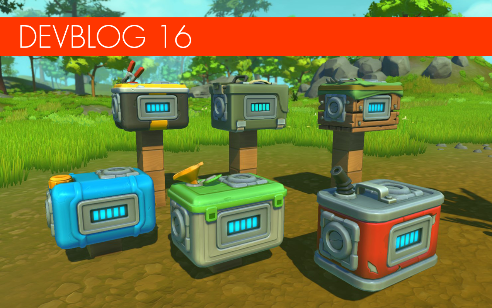

<head>
    <meta name="twitter:card" content="summary_large_image" />
</head>

**Hi Mechanics!**

It's time to sit back and relax because we have a ton of new survival stuff to share with you. 
<!--truncate-->
In this devblog we want to dig deeper in to some survival mechanics and consumables that we have been working on. But before we jump in to all the goodness we would like to answer one of the biggest questions we get the best we can. "When is survival mode coming out?" Over the past months things have really been moving fast at the Scrap Mechanic HQ and a lot of the core features are in place. We are feeling more confident with our internal release date. But we don't want to commit to an exact date just yet in case we want to add or optimize more things as we move forward. We really want to have this freedom to make sure that we deliver something that we are happy with. But our goal is to have survival in your hands in 2019. This is not a promise, just a goal. With that said, things are looking very promising from where we stand.

Now! let's jump in to some new awesome things we have been working on!

#### Resource containers

It's finally time to introduce you to how the resource consumption will work in Scrap Mechanic. Right now we have 6 working containers in survival mode. Gas container, Ammo container, Battery container, Seed container, Fertilizer container and Water container. All of these work as a chest for each specific resource. Fore example, you will connect the gas container to the gas engine to power your vehicle. The blue dots on the side shows you how much gas is left in the container. Pretty simple. Each container comes with two sockets as well. More on that here below. 

#### Pipe and socket

We are really excited about our new connecting system since it's both visual and easy to use. These pipes allow the player to transport blocks, parts and consumables from one place to another. For example, from a refinery to a craftbot in to a chest. This is how players will also be able to fill up containers without doing it manually. Let's say you build a gas station and want to fill up the gas containers on your vehicle. Then all you have to do is drive up to a pipe and make sure it's close to the socket, and it will start filling up the container. What's so cool about this feature is that it opens up a lot of possibility for automated chains and open up a lot of creativity.

#### Tapebot

Some of you mechanics that are following us on twitter have seen a sneak peek of our latest robot. The tapebot. Originally doing the packaging work in the warehouses. They have now gone crazy and covered large sections of the warehouse with tape, similar to a spider web. Shooting tape rolls at intruding mechanics. Fortunately, sharpshooter mechanics with spudguns will be able to dissemble the tapebots with a few well placed potatoes. The tapebots is one of the main reason why mechanics really have to stack up on potatoes before entering the large warehouses. You better shoot them first. 

#### Upgrade interactive parts

When testing out core gameplay in survival mode. We quickly noticed that 
some interactive parts are way to powerful to start with and made it to easy to survive. So we started testing the idea of having the interactive parts upgradeable. This was a great idea since it also added a really nice progression to the survival experience. For example a lvl 1 Thruster will consume a lot of gas quickly, but a lvl 5 Thruster will use less gas and allow the player to create flying vehicles later in their adventure. The interactive parts will be upgraded by using component kits found in the world. All the interactive parts will also change looks with each lvl making it easy to spot how upgraded they are. Of course, the higher the level the better they look and sound and more features are unlocked. In the [next devblog](/devblog/17#upgrade-parts-and-components) we will show these in-game. 

#### New encrypter

In our past devblog we presented a new part. The encrypter that hid all the connection points on the creation it was attached to. We have now made a new encrypter that makes creations indestructible until the encryper is removed or the creation gets blown up. This part will protect your creations from other players and farmbot encounters. But make sure you hide it well!

#### Challange mode

We have done some great progress on the challange mode that we hope to release in time for Christmas! It comes with 40 challanges to beat. Modders will also be able to create their own challanges and put them on the workshop. We also plan to put a challange editor in the future so that every player will be able to make a batch of challanges and share with other players. The challange mode will really put your building skills to the test. Only a true mechanics will pass all 40 challanges that we have prepared. 

#### New visual improvements

While the team is working away on survival, we have put one of our coders on giving the lighting and shaders some proper face lift to make Scrap Mechanic look up to date and a pure pleasure to look at. It's been way to long since we did any graphics improvements. We want survival to have a much stronger mood and atmosphere. Something we can't achieve with the current lighting and shaders. So we have done a lot of improvements that really makes the game a lot better. For example, metal material now really looks like strong shiny metal. We have also remade the vegetation and made much better trees and rocks. All adjusted to our new resource gathering mechanic. They now also sway beautifully with the wind. 
Day night cycle has also been added to our survival branch. We hope you enjoy the images demonstrating these new changes. 
We have a few more graphical improvements in the works.

**That's it for this time Mechanics! We will be back soon with more awesome stuff! Until next time!**

