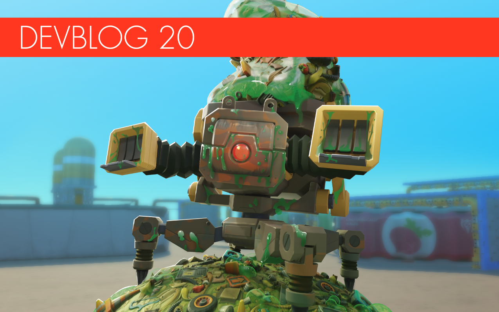

<head>
    <meta name="twitter:card" content="summary_large_image" />
</head>

**Calling all Mechanics!**

2020 is coming to a close and we're here to end it on a good note with a special devblog! Here are some of the things we've been working on since the release of Scrap Mechanic's Survival Mode earlier this year.
<!--truncate-->
To start, we have been hard at work on the next chapter and we will be announcing its official name at a later date. But until then, here are some of the things we managed to liberate from the Scrap HQ's secret drawing board!

#### Going underground

This new location includes new adventures and gameplay options that we can't wait to share with you! This new chapter of Survival Mode adds new quests and NPCs that will take you to the next stop in your journey: the mining island. For the first time in Scrap Mechanic history, you will be delving deep into the planet's mines, to uncover new, big secrets!
Here's a sneak peek into some features and concepts of the underground that are currently in progress.

#### Trash Bot

It's a good thing Scrap Mechanic doesn't come with Smell-O-Vision! Introducing the biggest bot we've made so far: the Trash Bot. 
This smelly clanker is the very first boss of the game! Rumour has it that you can find it on the Warehouse rooftop, collecting junk. 
If you do run into him, you'd best have your spudgun at hand or you will end up in the trash with the rest of the smelly produce! 

#### Sticky wheels

New update, new parts. And these wheels will be a lot of fun!
With the help of the new Sticky Wheels, you'll be putting together vehicles that can dig and drive in every direction, so you can go deeper than any mechanic has ever gone before. 

#### Red Guy

A new challenger explodes into the scene!
It's the latest addition to the Totebot family, the Red Totebot: those canisters on its head explode on contact, so make sure you keep this one at a distance.
Pro Tip: Try getting it with a few well-placed spud shots before it gets too close for comfort. 
 

#### Hot Chilis 

With great chili, comes great responsibility. This plant is definitely going to bring the heat on you and your farm! So make sure to give your base's defenses a boost because those chilis sound like trouble! Just watch out for the kind of bot it attracts. It sure looks like a handful.

#### Plasma Drill

The basic drill is a great tool to attach to your vehicle for digging, but it can't break through some of the tough layers of rock in the underground. 
Thankfully, it looks like the devs have got you covered: introducing the plasma drill; a new part for your vehicle! With its added power and improved reach, you can bore through the pesky underground bedrock. Did we forget to mention that it's more comfortable to use than the basic drill too?

#### Warehouse changes!

It looks like the devs are planning to update the Warehouse.
They'll be giving it a bit of a rework, by changing a few things around and adding some new elements. For example, parts that mechanics find inside are not removable at this moment. However, they will be after this update! 
But that's not all: the new Warehouse will be including additional quests and story elements. Best watch out, because things are going to get dangerous.
A WARNING FROM THE DEVS: the new update might cause the old warehouse key to turn into a circuit board. We will be introducing a new warehouse key in its place when the next chapter is out.

#### Wardrobe

What's an update without some brand new threads for your Mechanic?
The next chapter will be introducing a lot of funny shirt designs, along with some special rare outfits. For example, take a look at the welder outfit that will be included in the next chapter:

That's all we've managed to slip under the devs' noses so far, Mechanics but remember: this is a just a sneak peek into the mother load of content that the next chapter is going to contain. The devs have a lot more irons in the fire and they'll be bringing them out in the following dev blog, so stick around for more awesome news.

Happy Holidays Mechanics! We hope you have a creative 2021!
See you next year!

We love you! 

