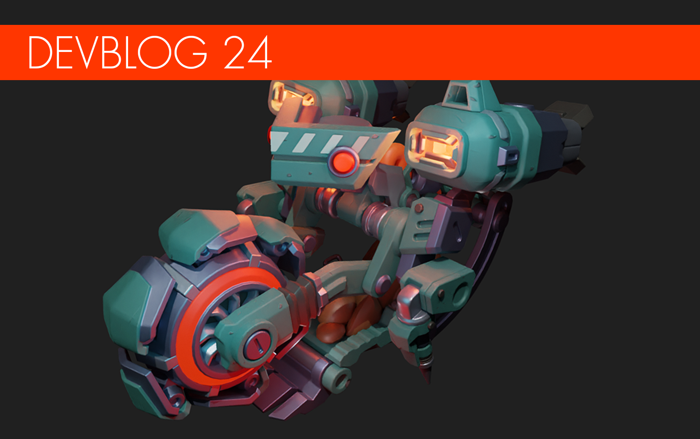

**Calling all Mechanics!**

New devblog, coming though!
It’s been a busy month for us, as we have been moving the Scrap HQ to a bigger and better office; the team out-grew the old space, and things were getting as cramped as a Woc Crate. Not to mention all the exciting new additions we have been making to the game that we can’t wait to share with you!
<!--truncate-->
So let’s get to it!

#### Minerbot
What’s that coming up from the mine? It’s a new bot! Introducing the Minerbot: Scrap Mechanic’s first flying bot!
These heavily overworked bots are flying on fumes: after all, they’ve been digging random holes underground in every direction, slowly overheating for who knows how long. If spotted, the Minerbot will spray any Mechanics it detects with a shower of rocks. While Minerbots are not as accurate or alert as the Tapebots, they can become very dangerous, very quickly in large numbers. But even if you do shoot them down, watch out; Minerbots can still crash into you! 
The Minerbot is shaping up to be something that can even top the current bots. 

#### UV Grow Bed
Plant a farm underground or on your creations, with the aid of the new UV Grow Beds! This new farming item gives you greater flexibility than ever, in exchange for electricity. 
But be careful: bots can still find you and your precious crops, so you’d better encase those veggies in some sturdy material. And while you’re at it, why not make a gun turret, for good measure? 

#### New Lighting System
This has been a long time coming, and it’s almost done: the lighting system in Scrap Mechanic has been completely reworked for the next chapter.
This significantly improves the game’s visuals and further optimizes the frame rate for players. Now, you can enjoy better performance, even with higher resolutions like 4K. We can now run double the amount of light sources and are no longer limited to 24 cast shadows anymore; any light that casts a shadow can now render in real-time. 
But wait, there’s more: we now also have volumetric lighting in our engine that looks stunning. Even the particles are volumetrically lit! This all helps create the look and the mood that we always wanted to evoke in Scrap Mechanic, especially in the next chapter. 

#### Builder Quests 
We know that the world of Scrap Mechanic Survival is very pretty, but that it’s also pretty empty at the moment. That’s all about to change with the new builder quests: while you’re out exploring and collecting resources, you will come across characters that need your help to build a variety of things. Help them out and they will all have some great rewards in return!

#### Fire in Scrap Mechanic
Ever wondered what those “flammable” entries in the item descriptions mean? At long last, we have added a fire game mechanic; now, fires will spread if you do not put them out.
And with its introduction to the Red Totebots, we expect that things are going to get a lot more heated. This might be a good time to check whether your base is fireproof. 
We thought it might be interesting to also show you how the fire mechanic in action; fire is a lot of fun to play with in creative mode, and it’s certainly satisfying to watch!

#### New Warehouse
The new warehouse is finally done! There are new sections, secrets, better rewards, and some really interesting content hidden away on the top floor and the rooftop that are waiting for you to discover it. We did manage to sneak out some images from the dev team that don’t spoil too much, so here goes!

#### Outfits
Our digital fashionistas have been hard at work putting a lot of new outfits together and we are getting close to having them done! Of course, we will be leaving a few for you to discover on release. 
This time, however, we will be revisiting two old outfits we had gotten wrong the first time: apparently, the farmhand and farmer outfits had been missing their backpacks, so we fixed it! Which one do you like best?

#### Drill Spawner
Even under the ground, there’s no peace for a farming Mechanic. When you’re hard at work in the bowels of the earth, watch out for these burrowing enemy spawners!

#### So what’s the status of the next chapter, devs?
Time for some dev transparency. 
We are fully aware of all the Mechanics that are waiting for the next chapter to finally come out. We see you on our Twitter, and we really do understand! 
We always try to be optimistic when it comes to our releases. But making quality games is a lot of work. We know that you have high expectations and we want to live up to them with the next chapter.
A new thing that is currently slowing things down is our decision that the huge release of the next chapter is also going to be the update that will take Scrap Mechanic out of early access. So this changes a few things:
It means that a lot of extra polish and optimization have to be in place as well on release. This doesn't mean it’s the last update, however; it just means that Scrap Mechanic will be in a released state. 
So to reiterate, we are polishing up the game, adding a ton of new content on top while also adding more things to our game engine at the same time. The next chapter is shaping up nicely on our end, but we have to let it take the time it needs to become something worthy of your time and expectations as well as something that we can be proud of.

We are sorry for the long wait, and that Mechanics will have to wait a bit longer but we will deliver Mechanic awesomeness! And that’s a promise. 

We are considering setting up another dev Q&A, so if you’d like us to dig away at your questions, please let us know!