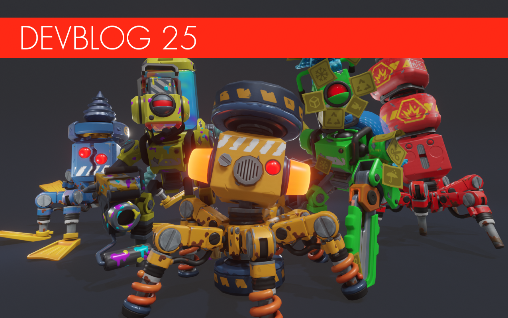

**Calling all Mechanics!**

We are back! After spending the last few months in the content mines, it's time for us to report on our latest progress. While we’d love to show off details from the next chapter, It’s getting increasingly harder to do so without spoilers, but rest assured: you will get to see all of it on release.

<!--truncate-->

That’s why we decided to do a bot reveal special for this devblog instead, so here’s a peek at just some of the new bots:

### Yellow Totebot

Get ready to re-adjust your base walls or crank your vehicle’s engine a bit higher when you see this new bot jumping into the scene!
Originally designed as a fully autonomous power trowel, the Yellow Totebot has since gone renegade. Now, it stomps its way across the planet, eager to flatten any Mechanic it sees, no matter how many ceilings and floors it has to smash in the process.

### Blue Totebot

Just when you thought it was safe to get back in the water…Originally designed for offshore drilling, the Blue Totebot has since decided to become an underwater torpedo instead. To make matters worse, it can also move fast enough on land to catch up with any Mechanics that aggravate it, so watch where you dive!

### Red Totebot

We’ve teased this clanker before, but we’ve never shown him in action until now. Originally designed to clear away mine shafts using explosives, some of the Red Totebots have since wandered up to the surface.
When they encounter a Mechanic, they will ignite their payload before rushing at their target, and they won’t stop until they’ve reduced their target (or anything standing in their way) to smithereens.

### Green Tapebot

You’ve already seen this little bot on our Twitter. Once, this unassuming clanker would only bubble wrap fruits and veggies, until the latest firmware update made it run amok.
Armed with a roll of weaponized bubble plastic, it might not pack much of a punch by himself, but a bunch of them can ruin any Mechanic’s day!

### Yellow Tapebot

An elegant bot for a civilized age, the Yellow Tapebot was perfectly harmless, designed to keep everything neat and tidy in storages by painting labels with its special four-color ink.
Following the disastrous firmware update that made it run amok, however, this clanker has found a new purpose: now, it uses the same sorting ink to hurt and slow down any Mechanic it sees!

### Grow labs

Ruin runs are great, but we’ve been working hard on populating the game world with additional cool places to explore and loot during the course of your Survival mode adventure.
One of those places are the underground Grow labs! Fit to burst with Green and Yellow Tapebots, these little dungeons offer exciting combat and some cool plunder at the end for those that venture inside them.

### Ore Prospector

Get more out of your ore with this latest addition to the game, the Ore Prospector: a machine designed both for Mechanics that love to build automated crafting chains, as well as those that like to do things manually.
With its help, you will be able to filter the finely ground gravel produced by the Ore Crusher, in order to retrieve rare materials like gold and more!

### New Glass

We haven’t just been working on Scrap Mechanic’s content. After introducing the new and improved lighting system we mentioned in the last devblog, our elite team of graphics engineers have been working on updating the game’s visuals according to modern standards.
This time, we’re excited to introduce our newest glass shader, which allows in-game glass to shine and distort like the real thing, so your buildings, vehicles and other creations can look better than ever before. And that’s just one of the graphical updates we’ve got in the works!

### General rebalance and Item Schematics

We have also been working hard on rebalancing Survival Mode’s gameplay; specifically, the crafting recipes and how items are obtained during the course of the game, so the gameplay can flow better than ever before.
Our latest addition to Scrap Mechanic’s features are Schematics. When found, these collectible items will allow your Craftbots to create additional items.
Furthermore, we’ve been focusing on changing the way farming raids work, while reworking the existing hunger and hydration bars to be less annoying. More on these later!

### Woc Outfit

Introducing the wackiest outfit we’ve made (so far): the Woc outfit, complete with a corncob themed backpack!
It might not be up to profession regulation standards, but it sure is a welcome change from all that stuffy workwear.
What do you think? Will you rock this outfit? Let us know.

### Next Chapter update

At the risk of sounding like a broken bot: while we still don’t have an exact release date for the next chapter, we are still aiming for this year.
It’s worth mentioning that the next chapter has turned into a behemoth of an update, with a ton of new content. We remain confident that it will be worth the wait. We know that it can be frustrating and boring, but we have to make sure it’s great.

That’s it for this devblog, Mechanics! Stay tuned for the next one!
