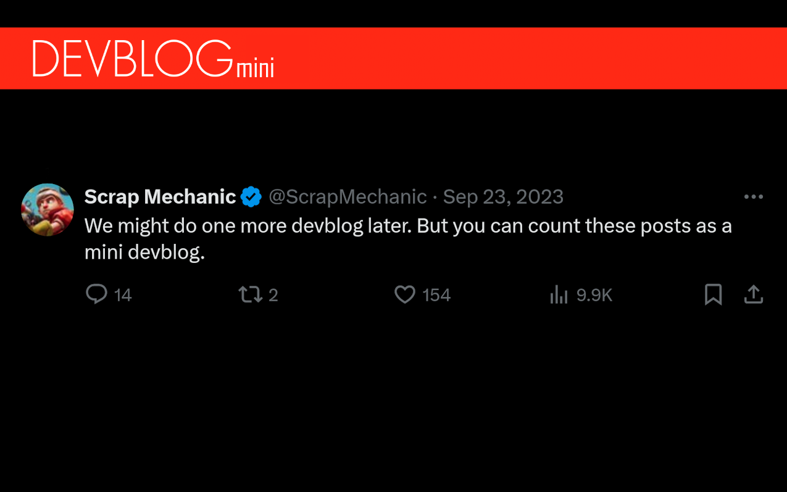
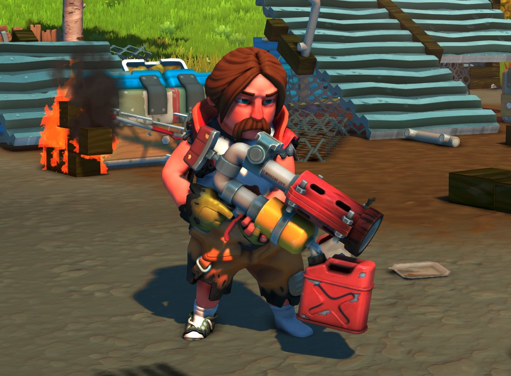
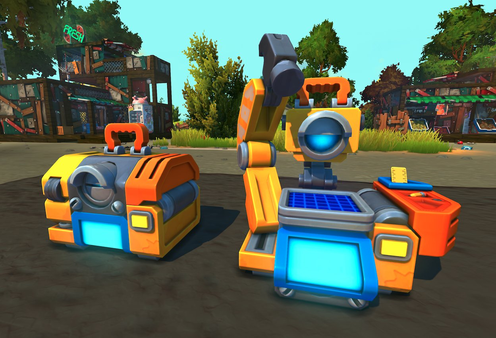
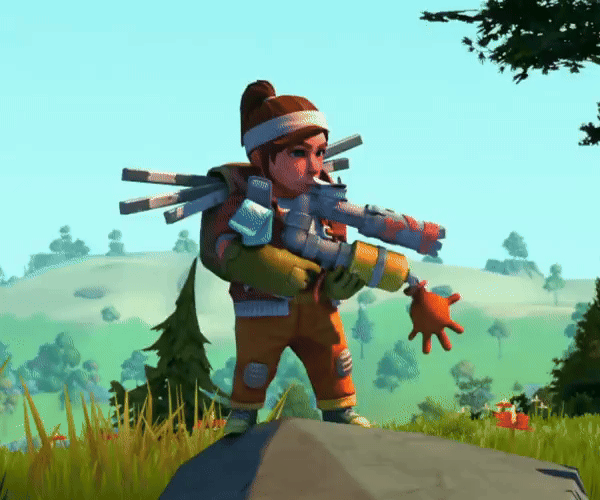
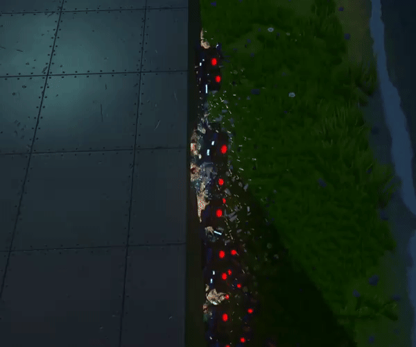
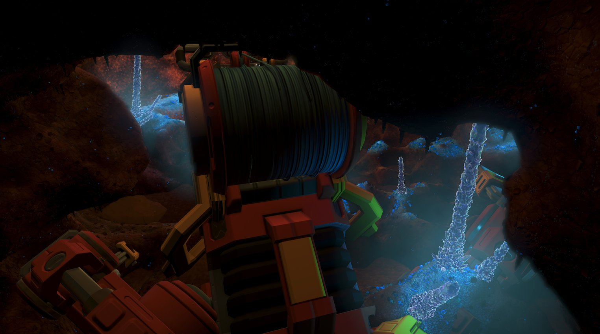

**Hi Mechanics!**  
We have some new content we’ve been working on lately that we can show! Both bigger and smaller additions to Scrap Mechanic.

<!--truncate-->

### Spud Launcher - [2023.09.18](https://x.com/ScrapMechanic/status/1703816199006568704), [2023.09.18](https://x.com/ScrapMechanic/status/1703818726724825236)

Today we will have a look at the new Spud Launcher that can turn creations and trees into ash!

And.. here is the new Spud Launcher in hand for good measure🔥

### Baby Craftbot - [2023.09.19](https://x.com/ScrapMechanic/status/1704180204363530458)

Introducing the new Baby Craftbot!  
This version is way more portable. It can craft basic blocks and useful parts. The Baby Craftbot can be a lifesaver when your survival adventures turn sour and you end up with a broken creation far from home.

### Boombox, Mitch Murder collab - [2023.09.20](https://x.com/ScrapMechanic/status/1704489649207411053)

It’s time to throw away your old Scrap Mechanic radio!  
We have teamed up with our friend [@mitch_murder](https://x.com/mitch_murder) to make a few robotic bangers for the new boombox. The boombox delivers great sound quality and will make cruising in your creation an even better experience!

### Scrap Spudgun - [2023.09.21](https://x.com/ScrapMechanic/status/1704902375079645268)

We will be adding the Scrap Spudgun early in survival.  
This new weapon is terrible! It does not shoot that far and has a lot more projectile drop.  
On top of that, It does less damage.  
We don’t recommend it.

### Fire Extinguisher - [2023.09.22](https://x.com/ScrapMechanic/status/1705282989762986149)

With the introduction of fire in Scrap Mechanic, we will be adding the Fire Extinguisher! This is not a new tool. Instead, the Fire Extinguisher works the same way as the fertilizer. It’s a good idea to stack up on these in case your creation catches fire!🔥

### Cablebot Update - [2023.09.23](https://x.com/ScrapMechanic/status/1705525864463516043)

More work has been done on the Cablebots!  
They are now really good at climbing up on creations.   
However, don’t worry. It will not be this easy for them to munch on metal blocks. This is just us running some tests.

### Structure in the Mines - [2023.09.24](https://x.com/ScrapMechanic/status/1706014263175782725)

Greetings from somewhere deep underground.  
In the derelict mines.

