**Hi Mechanics!**  
It’s good to be back with another devblog!  

<!--truncate-->

Where should we start? Let’s address the big question first!

### Where is the next chapter?

Believe it or not, it is coming along, but it hasn’t been without challenges. Earlier this year, we ran into some significant design and technical issues with the underground digging gameplay. Simply put, it wasn’t meeting the quality bar we expect from Scrap Mechanic.

Once we reached a version that felt right from a gameplay perspective, it also required a heavy optimization pass to make sure it performs well in a large underground world. That meant more iteration and testing than originally planned.

We could have made development easier for ourselves by lowering the bar or simplifying parts of the feature, but that’s not how we approach Scrap Mechanic. We care deeply about delivering something that feels fresh, solid, and worth the wait, even when it means taking longer. We’re now genuinely happy with where it’s headed, and we believe that will be clear when you finally get to play it. 

### So when is it coming out?!

It’s not this year, unfortunately. But we are very sure you will finally get to play the next chapter next year! The release date will be announced in the coming months, as well as the name! That’s all we can say right now.

Let’s jump into some new stuff!  
We noticed that we had enough spoiler-free content to make a new devblog.  
So here goes!  

### New Survival Terrain

The survival terrain has received a really big overhaul, and we finally got around to adding all the things that we always wanted for the generated survival world. The aim was to create more varied and visually interesting places: beautiful forest roads as well as bridges, new mountain formations, and better desert biomes. We also added new ruins, secrets, as well as making sure road systems are better and easier to navigate with improved linking. Here are some new shots from the new survival terrain.

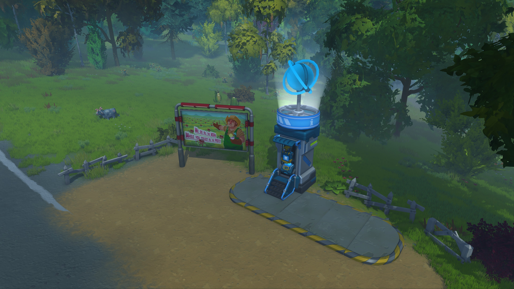
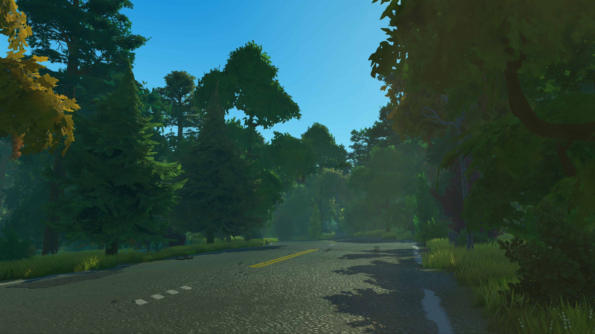
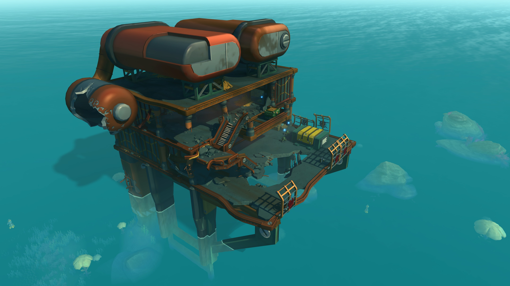
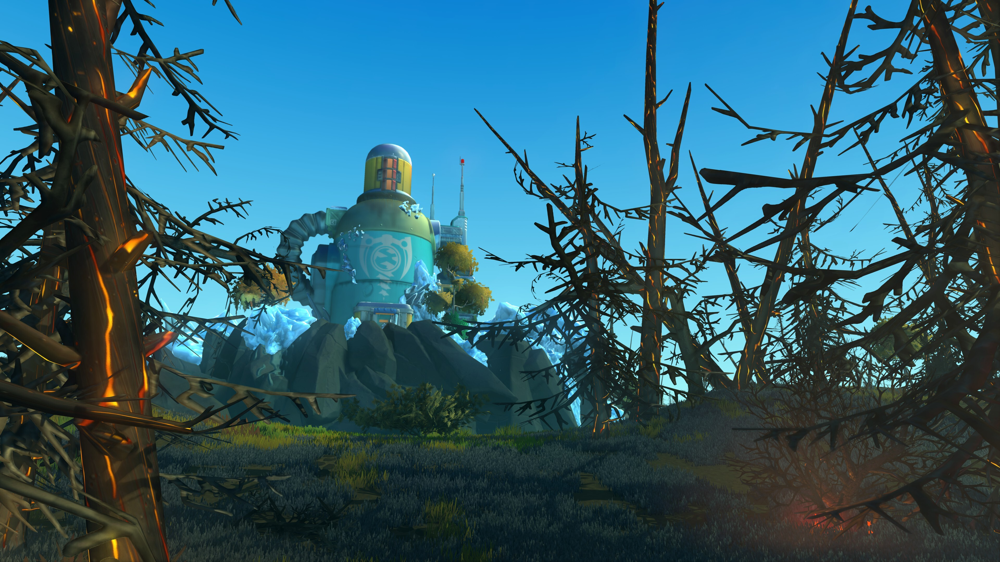

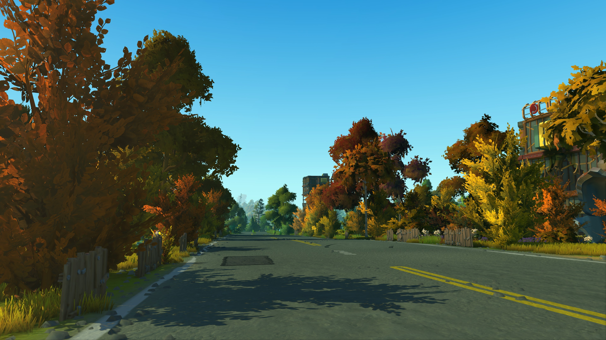

### Raid Redesign

Another part of survival that got a very big overhaul is the raids! We have turned it into a much more well-designed game element with a lot more depth than what’s currently in survival. The difficulty scales a lot better now. Enemies are a lot smarter, choosing better paths. We redesigned the raid UI and made the raids start right away when they get triggered instead of making Mechanics wait for a day. They are much more engaging and fun now, including a lot of our newer bots as well.

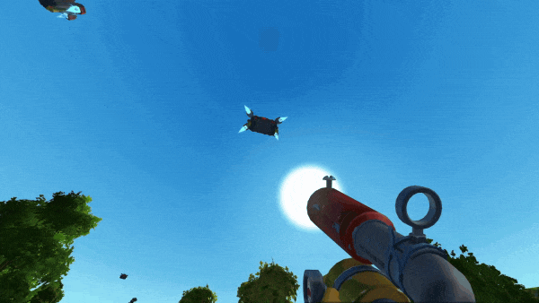

### The Cornade

We are excited about this one!
This is a new weapon in Scrap Mechanic called the Cornade. We noticed that some players ended up in really tricky situations in the warehouse and decided to add a grenade-type weapon to help in these certain unfair enemy encounters. Now that we’ve added it, we can’t understand why we didn’t do it sooner. We also made it super satisfying to use—simple, but a great addition to Scrap Mechanic.

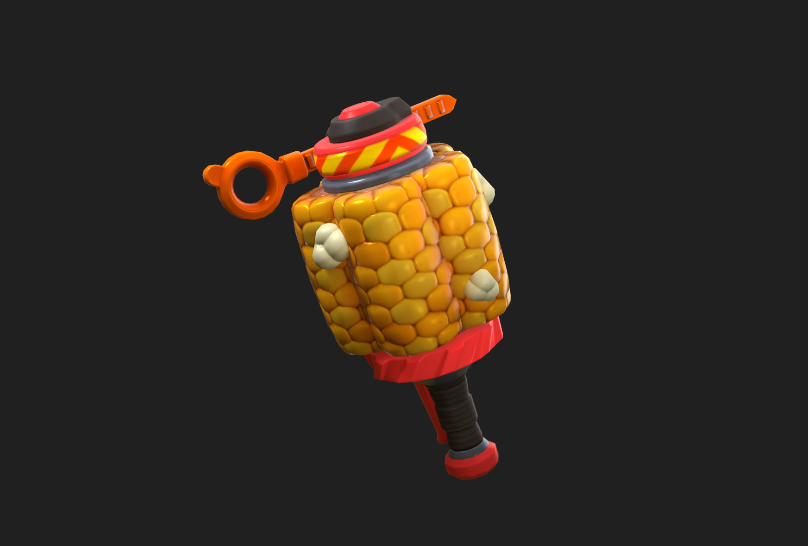
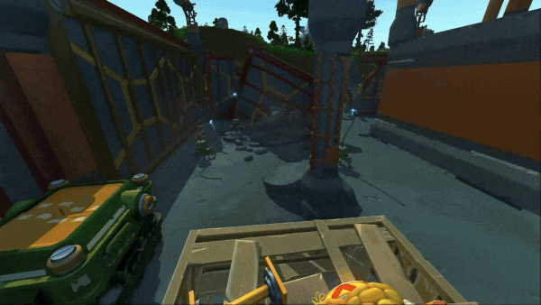
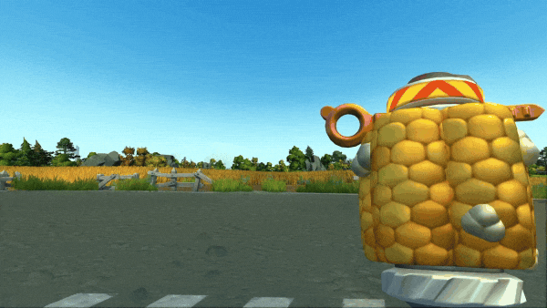
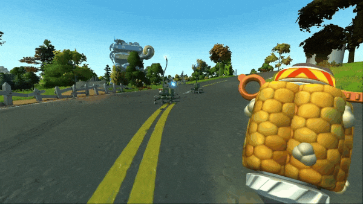

### Multishape Parts

Something that was always a bit of a problem with the building parts in Scrap Mechanic is that parts could not have multiple shapes within a single part. This is now resolved, and with that we’ve added a few new parts that have this new possibility. It’s a bit of a niche thing, but we want to have it included since it offers quite a few new and fun ways to interact with parts.

### Useful Ladder

Ever wanted to build a fire truck with a folding ladder? Maybe just have a ladder to keep your creations tighter without the need for a big staircase? Well, we added a ladder. Since Scrap Mechanic is a very creative and free game, we had to make sure the new ladder works on moving vehicles but also is possible to climb at angles you would expect to climb. Is it more superior than the toilet seat? You be the judge.

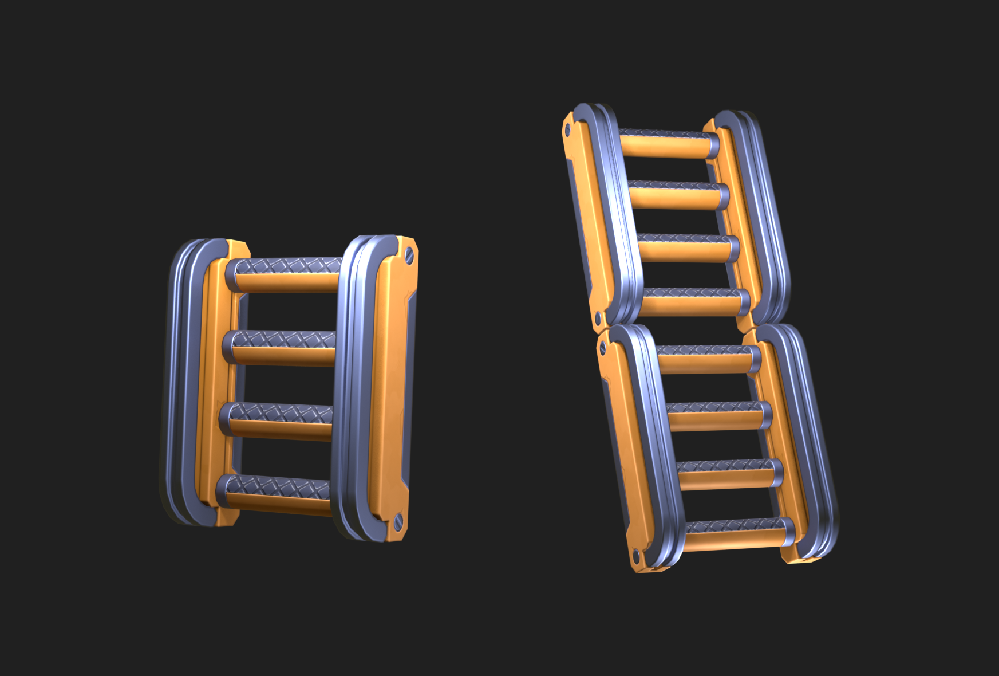

### Freezer and Ice Blocks

The ice block is a very low friction block, making the Mechanic slide on top of it. Together with slants, it’s possible to build slides among other things. To craft the ice block, the player has to obtain a freezer and add water! Using this block in creative ways can be very beneficial. Especially with transportation systems.

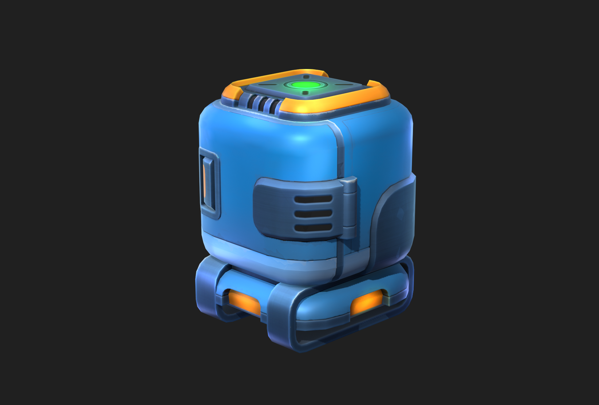

### Duckie Outfit

As a returning devblog tradition, we have to include a new outfit. This time, it’s time to reveal the Duckie outfit. It was on our drawing board for a very long time, and we finally got it made. Maybe one of our more wacky outfits, and really fun to mix with other outfits.

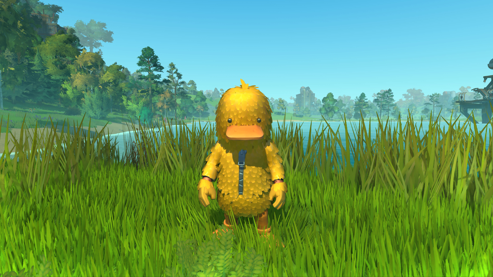
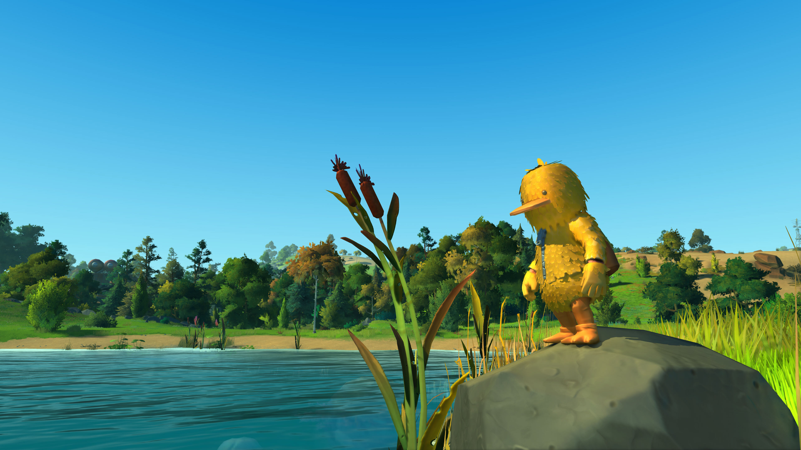

### Updated Trashbot

Some of you Mechanics who have been following previous devblogs might remember the stinky Trashbot. We iterated on him quite a bit after that. We ended up doing a lot of changes and improvements. He is now a lot more intense than what we started with, but also way more fun to fight.

There is a lot more content that we’ve been working on, but that is saved for the release.

We wish you an amazing holiday and a happy new year!  
Please keep a close eye on our channels in the coming months.

### Stay creative, Mechanics!