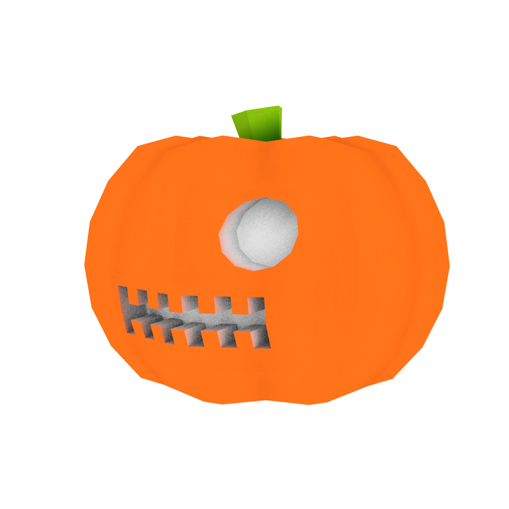
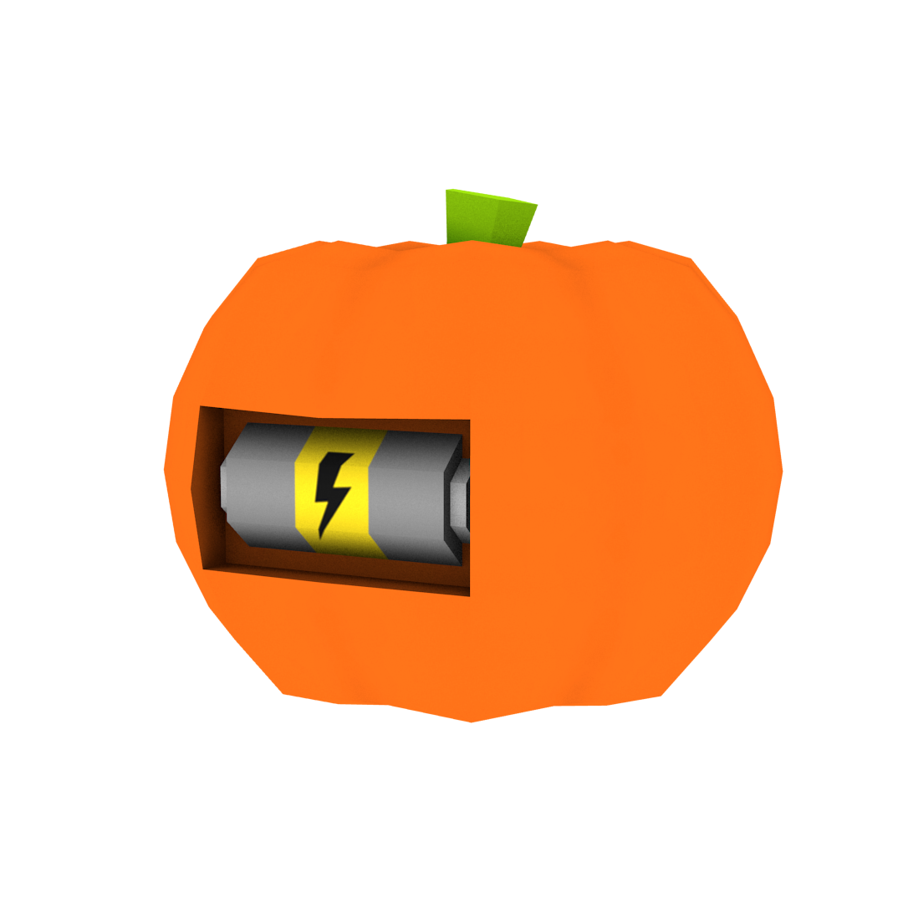
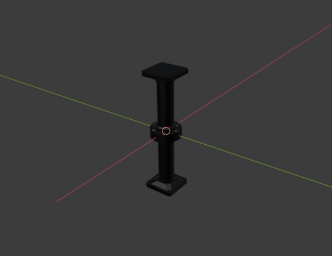
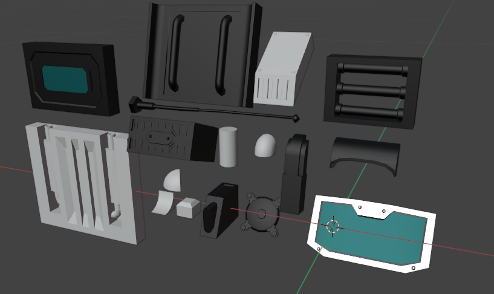
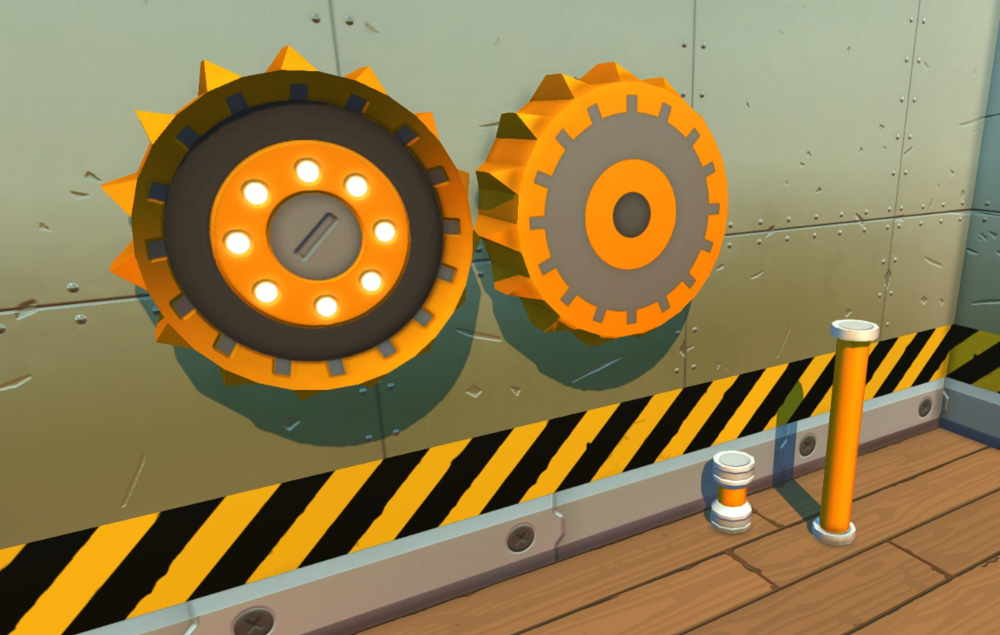
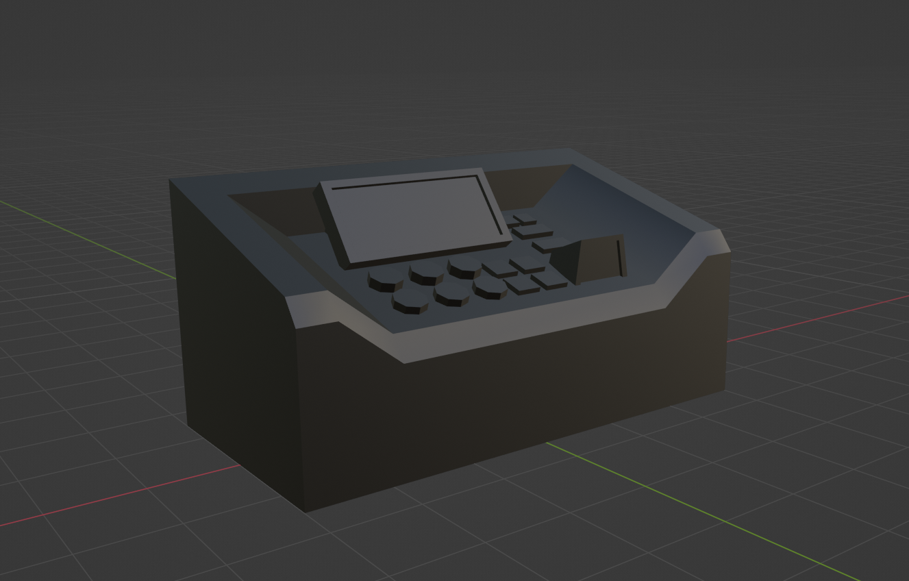
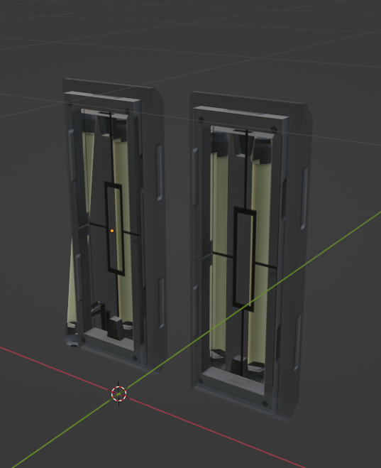
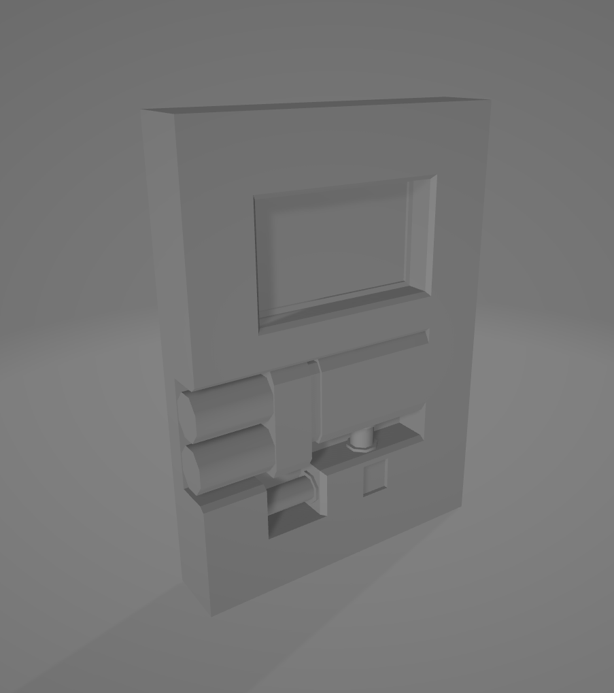
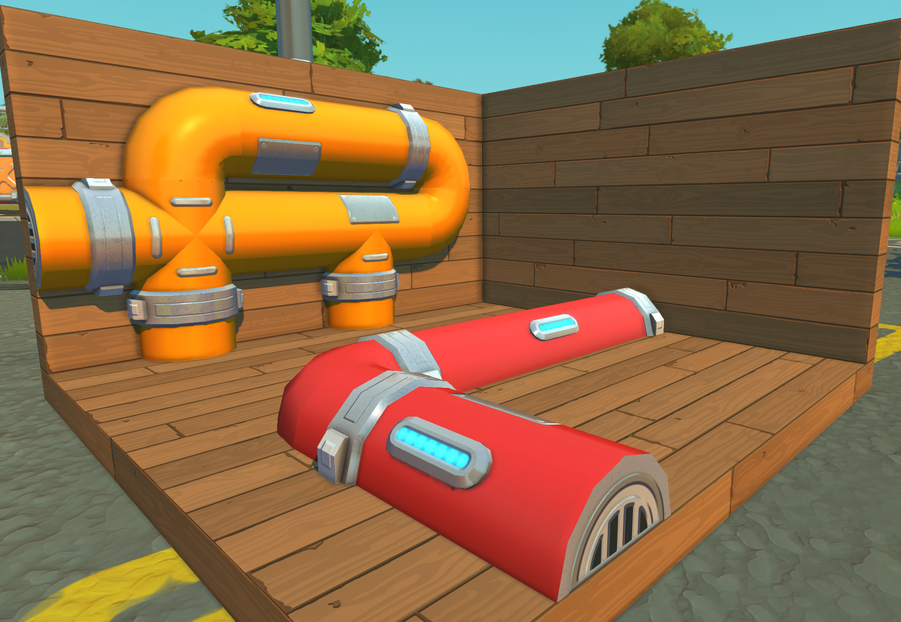

import Credit from "/src/theme/Credit.tsx"

### Plastic Pumpkin
> Found by <Credit id="trbodev"/>, Files from <Credit id="technologic-nick"/>, Rendered by <Credit id="charging-turnip"/>

### Piston 2
> Found by <Credit id="trbodev"/>, Image by <Credit id="ivancohe"/>

### Survival Car Parts
> From [Devblog 7 - "Cars In Survival Mode"](/news/devblog-7#cars-in-survival-mode)

> Image by <Credit id="bananacat"/>

### Maintenance Spaceship Interior Gear
> From [Devblog 18 - "The Crash"](/news/devblog-18#the-crash)

> Image by <Credit id="red-gal"/>

### Maintenance Spaceship Interior Control Board
> "*Can't find any textures for it, the UV map doesn't look correct either. Looks quite a lot different from the tile asset broken controlboard of the ship we have now and is in .mesh format so it's probably quite old.*"

> Comment and image by <Credit id="dart-frog"/>.

### `env_building_fluorescentlight`
> Found by <Credit id="red-gal"/>

### Early Spaceship Door
> Found by <Credit id="red-gal"/>

### Half Pipe
> Image by <Credit id="red-gal"/>

