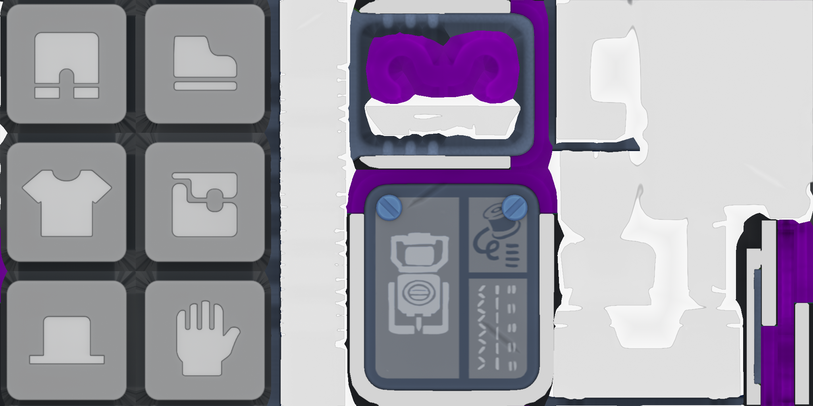
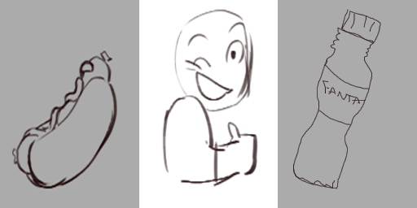
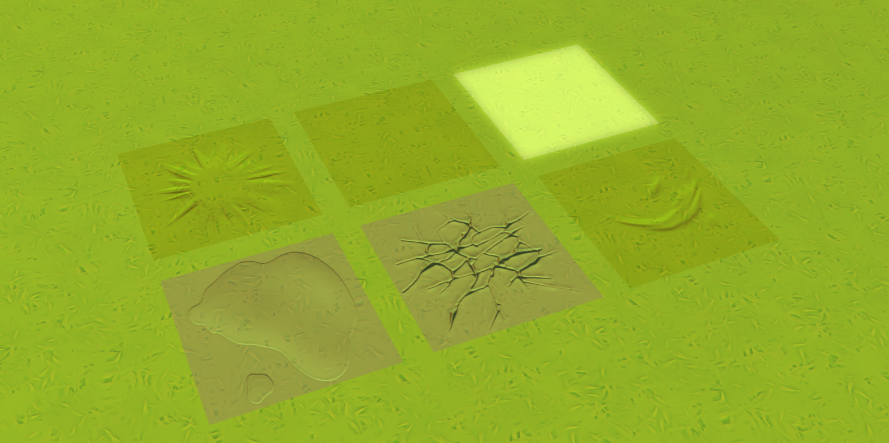

import Credit from "/src/theme/Credit.tsx"

### Outfit Package Hidden Icons
> Found by @trbodev

### Dead Duck
> Found by @trbodev

### Mechanic Station Billboard Alternate Texture
> Found by @trbodev

### Challenge Mode "Unlock Dress"
> Found by @mateusz-perczak
:::note
Added in 0.6.0
:::

### Old Warehouse Key
> Found by @red-gal

### Quest Markers
> Found by @dart-frog and @trbodev

### Tile Editor Icons
> Found by @red-gal, @trbodev and @dart-frog

#### `placeholder`

#### `tilehigh`

#### `tilemid`

#### `tilelow`

#### `voxelmesh`

### Test Decals
> Found by @red-gal

### Hidden "help" in Warehouse Filing Cabinet Texture
> Found by @red-gal

