### Unused Tile Asset Icons
> Found by BananaCat, Updated Icons from Red Gal

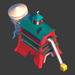
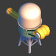

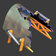
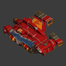
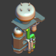
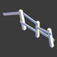
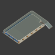
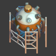
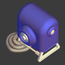
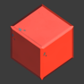

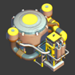

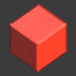
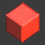
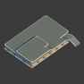
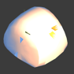
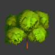
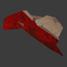

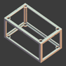
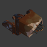
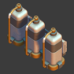
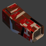
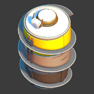
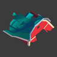
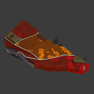
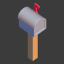
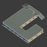
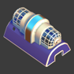

### Hidden Node Icons
> Found by Red Gal

<>{[
  'https://cdn.discordapp.com/attachments/835996787370098798/835996920010506320/AreaTriggerIcon.png',
  'https://cdn.discordapp.com/attachments/835996787370098798/835996921315196958/ChemicalsIcon.png',
  'https://cdn.discordapp.com/attachments/835996787370098798/835996922824228864/EffectIcon.png',
  'https://cdn.discordapp.com/attachments/835996787370098798/835996924259467294/EmptyIcon.png',
  'https://cdn.discordapp.com/attachments/835996787370098798/835996925646995456/EpicLootCrateIcon.png',
  'https://cdn.discordapp.com/attachments/835996787370098798/835996927526961162/FarmbotIcon.png',
  'https://cdn.discordapp.com/attachments/835996787370098798/835996929505755167/FireIcon.png',
  'https://cdn.discordapp.com/attachments/835996787370098798/835996931888644137/FlattenIcon.png',
  'https://cdn.discordapp.com/attachments/835996787370098798/835996933356519474/GlowgorpIcon.png',
  'https://cdn.discordapp.com/attachments/835996787370098798/835996947030212648/PlayerSpawnIcon.png',
  'https://cdn.discordapp.com/attachments/835996787370098798/835996950343843921/ReflectionIcon.png',
  'https://cdn.discordapp.com/attachments/835996787370098798/835996951916183572/TapebotIcon.png',
  'https://cdn.discordapp.com/attachments/835996787370098798/835996953556156416/TotebotGreenIcon.png',
  'https://cdn.discordapp.com/attachments/835996787370098798/835996955141472317/VectorIcon.png',
  'https://cdn.discordapp.com/attachments/835996787370098798/835996957100736552/WaterIcon.png',
  'https://cdn.discordapp.com/attachments/835996787370098798/835996958769545296/WaypointIcon.png',
  'https://cdn.discordapp.com/attachments/835996787370098798/835996960695386112/WocIcon.png',
].map((url,i) => (
  
))}</>