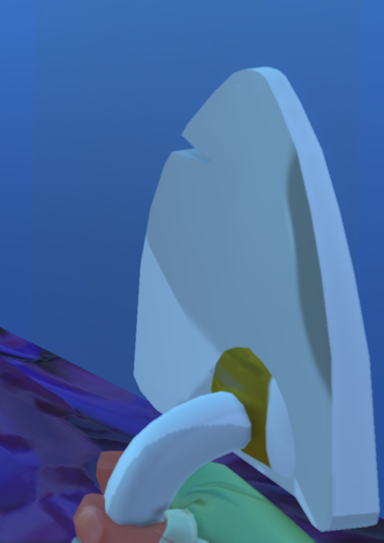
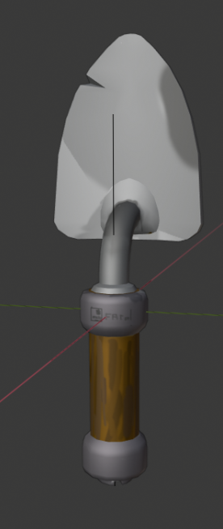

### Lift Remote
> Mentioned in [Devblog 17 - "A Big Lift"](/news/devblog-17#a-big-lift)

> Found and Rendered by @charging-turnip

### Lift Remote Animation Mockup
> Animated and Rendered By [Rager](https://youtube.com/channel/UCqWxNkrT4EmoL7O1pY2w3xw) on Youtube

<iframe 
  src="https://www.youtube.com/embed/2BlEAF-f6j0" 
  style={{ aspectRatio: '16/9', width: '100%' }} 
  frameBorder="0" 
  allow="accelerometer; autoplay; clipboard-write; encrypted-media; gyroscope; picture-in-picture" 
  allowFullScreen 
/>

### Garden Shovel
> Found by @charging-turnip, Images by @rockstar-modder

### Spline Camera Showcase
> Video by @red-gal

:::caution Notice
This tool was removed in 0.6.0 but may return in a future update as mentioned in [Devblog 23 - "Cinematic Tool"](/news/devblog-23#cinematic-tool).
:::

:::tip Usage Instructions
> Obtained by using the `/camera` command in survival mode when `g_survivalDev` is `true`. 

|Action|Keybind|Default Keybind Key|
|-|-|-|
|Place Spline Path Node| `Rotate`|`Q`|
|Play Spline Path|`Remove / Secondary`|`Right Click`|
|Remove Spline Path|Hold `Build / Primary`|`Left Click`|
|Save/Load Spline Path to/from Disk|`Reload`|`R`|
:::

:::caution
To load a spline path from disk you must move or remove the current spline path on disk first **or else you will permanently overwrite the spline path on disk with the currently loaded spline path.**
:::

<video
  src="/videos/spline-camera-showcase.mp4"
  controls
  style={{ width: '100%' }}
/>