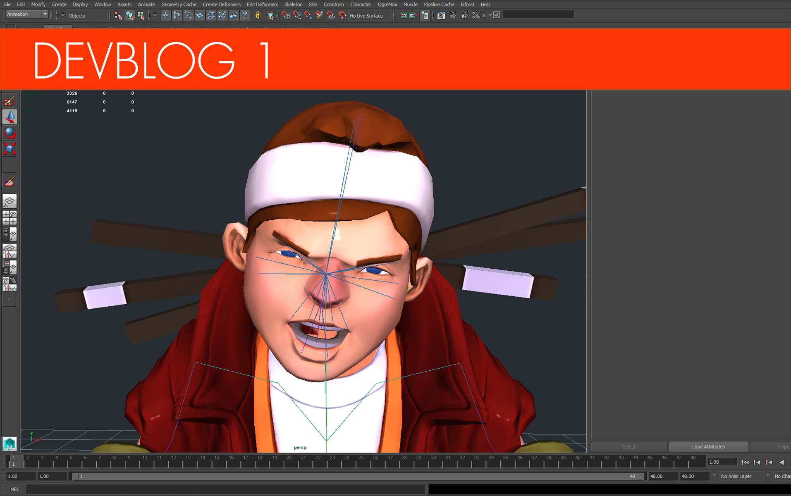
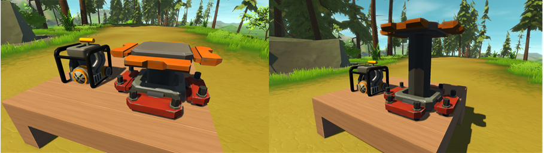
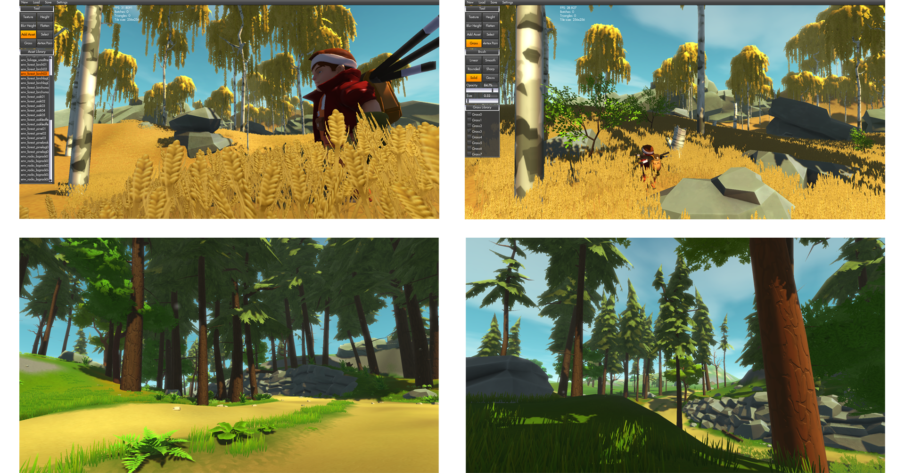
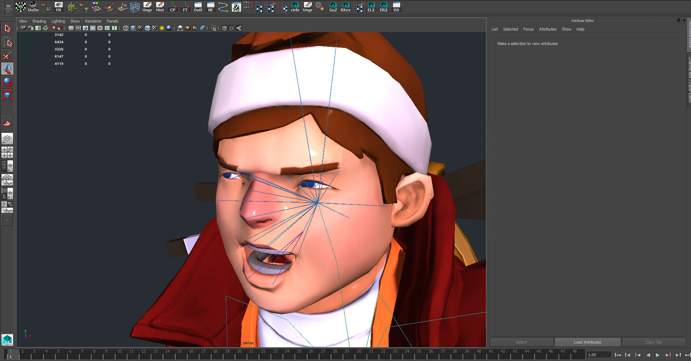

<head>
    <meta name="twitter:card" content="summary_large_image" />
</head>

**Hi Mechanics!**

As busy as we are with developing the game, we still really want to keep you up
to date on all our progress. So here's the first edition of our devblog that
we'll post from time to time.<!--truncate-->  Let's start off with the
graphics.

---

### Character improvements

Our talented artist Adrian has been giving the character a little bit of
well-needed grooming, making sure he's looking nice and tidy. There were a few
things that weren't looking that great on him, one of which being his yellow
knee patches, which are now all fixed up and looking way better. Heck, we even
added buttons to his backpack and normal maps. No doubt we'll see to it that he
gets a few more improvements as we go along...

---

### Key items have been getting some texture love

   We've also made some sweet visual improvements to the Lift
and the Gas Engine. They were looking nice and clean before, but maybe a tiny
bit bland. After adding some spec and tearing they now feel like they have some
weight.

---

### Beautiful new tall trees added!

   We've also added two new types of tree. Firstly the tall Pine
trees that you might have already seen if you follow us on Facebook and Twitter.
But we also added our own Galactic Birch Trees. We felt we really needed
something that broke off from all the green and made things pop a bit in
different colors, which is exactly what we believe our new birch trees achieve.
We also added a few new bushes, logs and flowers.

---

### Terrain painting

We also added vertex color support to our terrain editor, meaning we can now
paint ground textures in different colors, giving the terrain more color
variation. This also means we're able to change the color of any tree and grass:
no more single color textures! Now the game will look even better! This'll also
be a great feature to have once we release the terrain editor for you guys to
use and play around with!

---

### New, fresh LoDs

Better LoDs were something we needed. We weren't really happy with how they were
previously, so decided to redo them. The trick is to avoid clear popping when a
tree changes from a low poly to a high poly model as you walk towards it. Also,
some rocks were missing LoDs so we added those in as well.

---

### Facial expression

   Our hero doesn't currently have an expression, but we've been
working on a face rig so we can animate expressions for him. We reckon it'd be
pretty cool if you could see the fear on his face if you drove too quickly, or
check out how he focuses when he's building; this might soon be a reality!

We reckon it adds loads more personality and makes the character so much more
likeable.

---

### Progress on multiplayer

Multiplayer development has been going smoothly; there's a bit of work left, but
it's slowly getting where it's supposed to be.

---

### Introduction videos

We've started work on a series of videos that will introduce you all to some
very useful items you can find in Scrap Mechanic. "How does the Lift work?" and
"How do I build a car with a gas engine and a driver's seat?" are questions
these videos will answer for you!

Check out the first video introducing the Lift here. The next one is coming
soon!

<iframe
    title="How does the Lift work?"
    src="https://www.youtube.com/embed/OifCVmm5Yi4"
    frameBorder="0"
    allow="accelerometer; autoplay; clipboard-write; encrypted-media; gyroscope; picture-in-picture"
    allowFullscreen
    style={{ aspectRatio: '16/9', width: '100%'}}
/>

---

### Secret

We're also working on something secret. We can't wait to reveal it!

If you have any requests or suggestions, feel free to contact us via Facebook or
Twitter We love hearing from all you future Mechanics!
