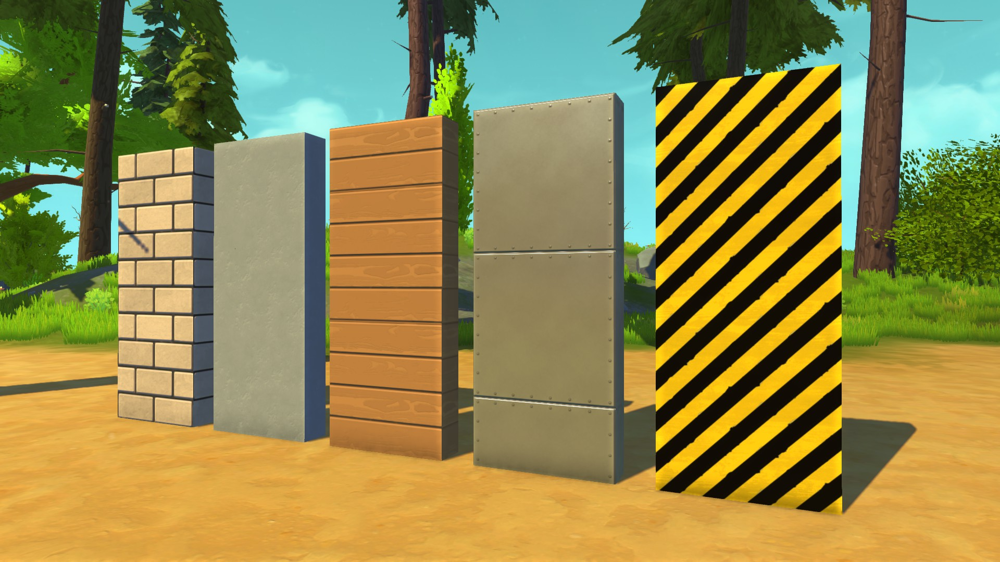
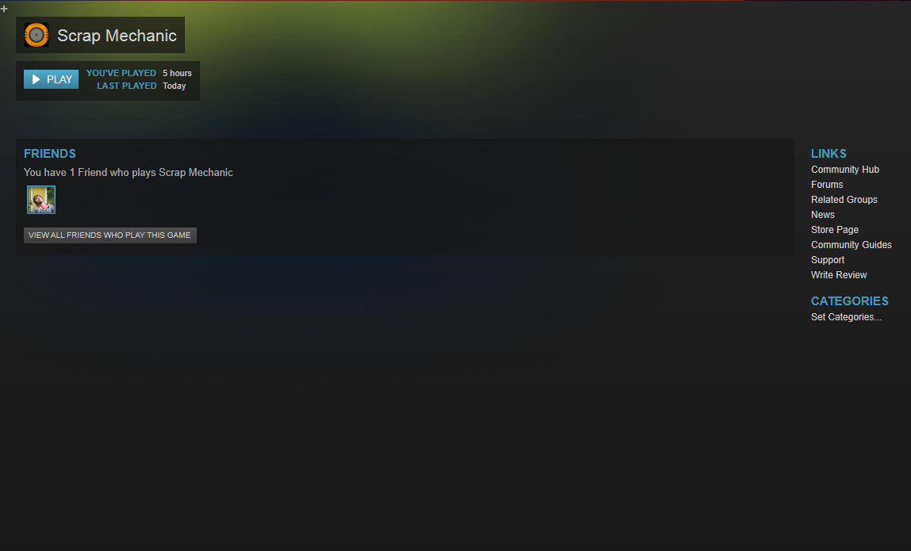
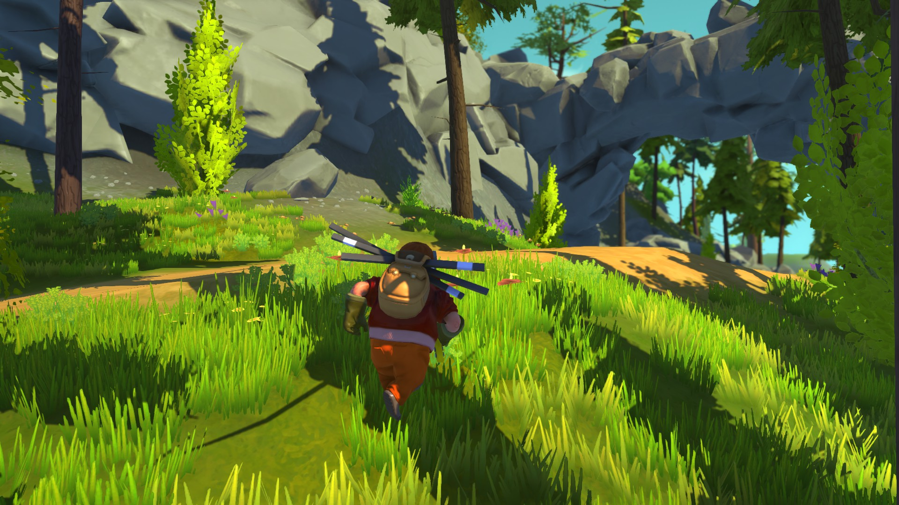
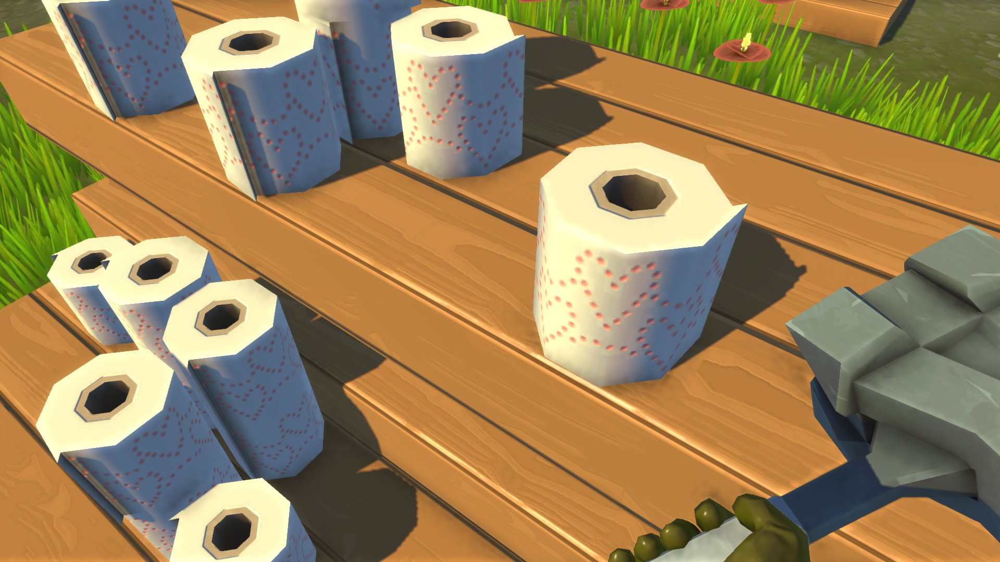
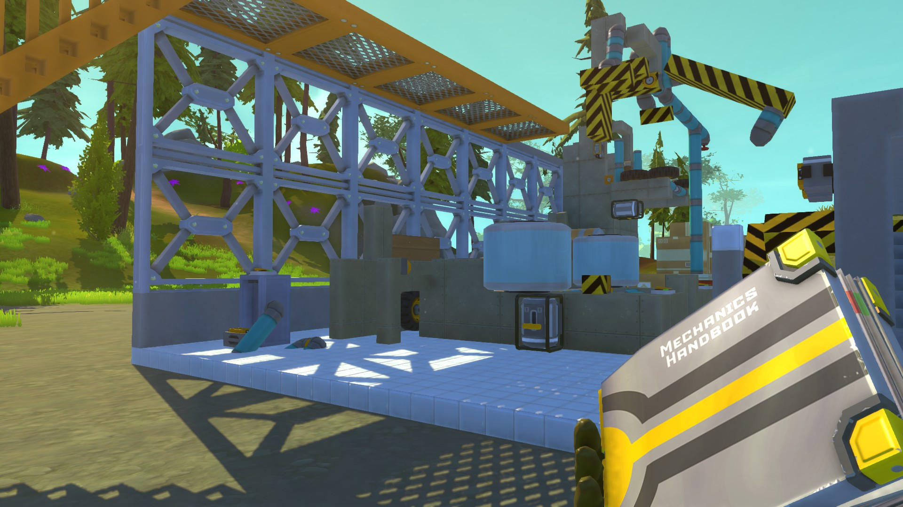

**Hi Mechanics!**

Another fantastic month has passed! Feels like we've been working 25 hours a day
this last month and the coffee machine at Scrap Mechanic HQ has been put through
the ultimate stress test!

<!--truncate-->

Bugs have been squashed and awesome has been added. Highlights? Highlights:

---

### Build a Great-looking Hideout. Fast!

   Our base blocks have really been improved with new
textures! They've gone from basic, plain colors to now looking like different
materials. Best of all, they've all got different weights, so keep that in mind
when you build vehicles. These blocks can be scaled to build big structures in
no time at all!

---

### Fluffy New Clouds

   Since we started work on the game we've badly needed a neat
skybox - we just never got round to making one. Something wonderful happened the
other day though, when our talented artist created a flying machine and took to
the sky with his mighty pencil. The result is nice: stylized, but not childish.
Just the way we wanted them. Unfortunately our artist crashed somewhere and got
stuck in a giant pine tree. We hope for his speedy return with fingers and
talent intact.

---

### Scrap Mechanic on Steam!

   Hold on Mechanics! Calm down! This doesn't mean the
game is out yet, but it does mean we're currently implementing the game with
Steam. We're still making daily changes and testing it all out, and we'll be in
that phase just a little longer. All this means that we're getting closer, so
it's still great news!

---

### Terrain in Creative Mode

   We've added more vegetation, grass types and
rocks! The Creative Mode terrain is starting to look nice and lush. It's gonna
be a great place to test out your machines, and we've even added a few sweet
jump ramps here and there for all you daredevils!

---

### New, Exciting Building Parts!

   We've added lots of new building parts for
you to use in your creations. The game now has over 100 building parts, all
lovingly modeled and designed from the ground up. We won't be showing you all of
them until you get your hands on the game, but some of them are straight up
silly. Like this toilet paper roll... Yes, you can actually make a house or
vehicle out of toilet paper.

---

### General Fixes, Improvements

Maybe not the most fun to read about, but a lot of our time has gone into
actually cleaning things up. Adjusting and improving. We aim to make sure that
the game maintains a good experience for the players throughout Early Access,
and for that we need to make sure the framework is as neat and stable as
possible.

---

### Release Date Coming Soon!

   We're really excited to let you know that we'll be
releasing Scrap Mechanic to early access pretty soon. We've finally reached the
point where we feel the game can offer a lot of fun playtime in its current
state. The first early access release comes with a creative mode filled with
over 100 parts that will allow you to build some truly amazing machines. It also
comes with an easy to use in game handbook explaining how all the tools and
items work. The creative mode world is not endless, but is more than big enough
to build just about anything you want. Oh, and it comes with multiplayer support
so you and your mechanic friends can be creative together. Stay tuned for a
release date and price in the coming weeks!
