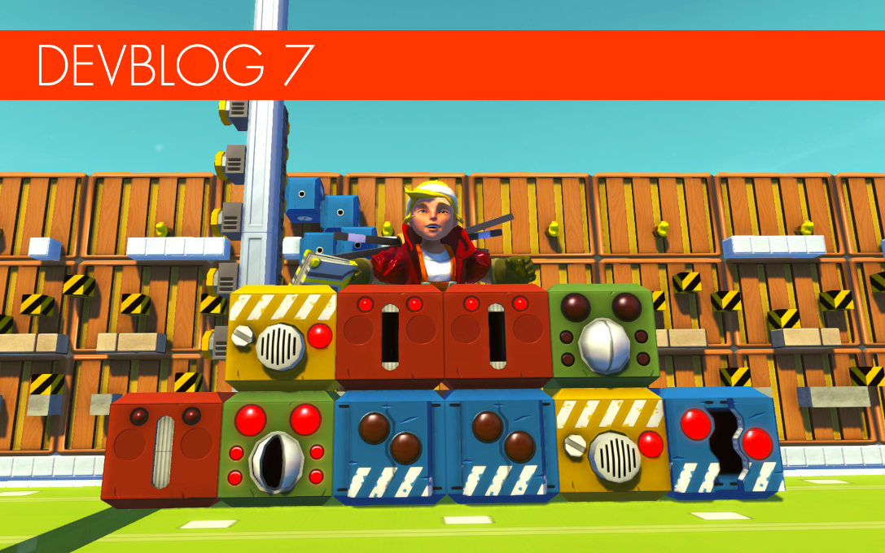
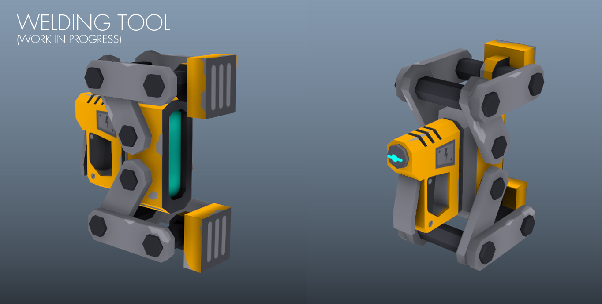
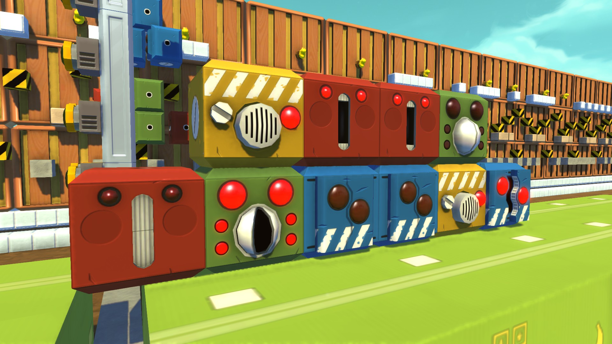
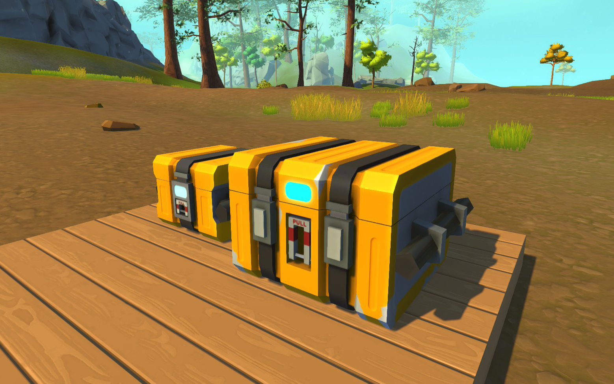
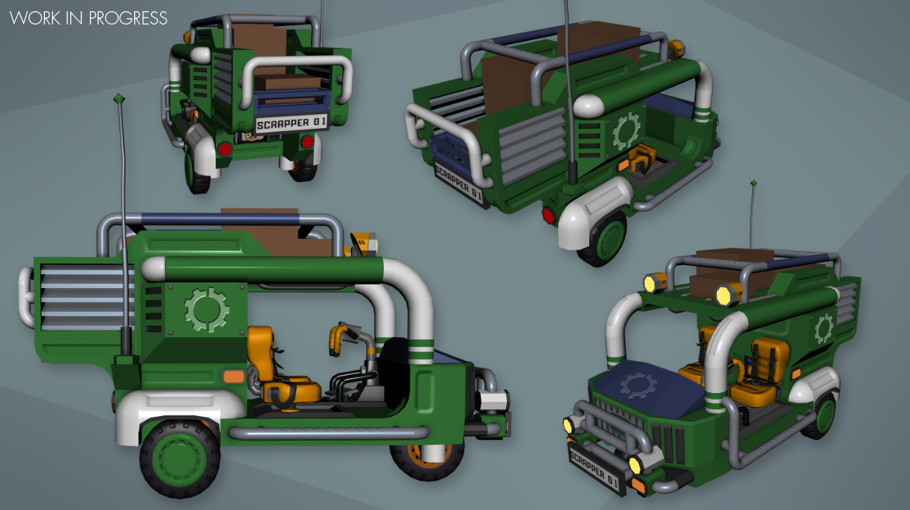
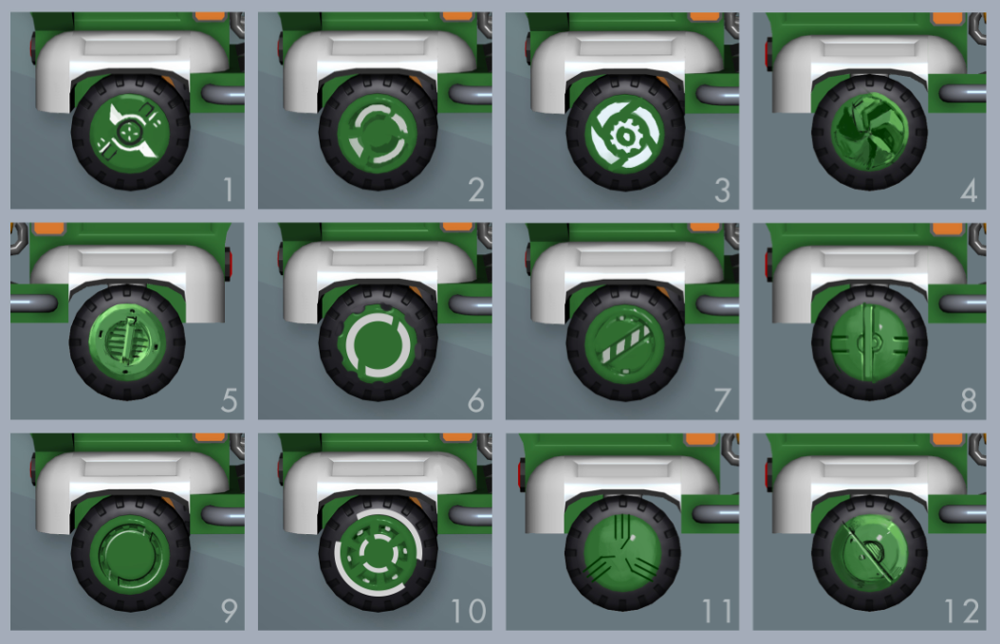
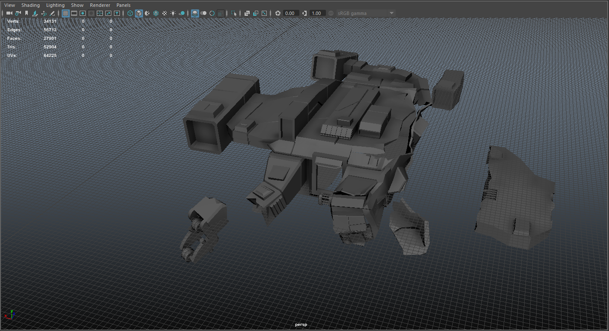
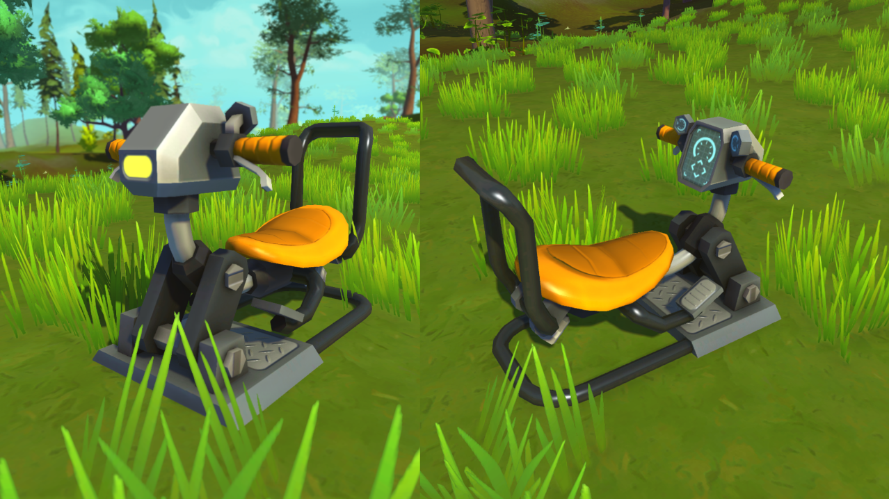

<head>
    <meta name="twitter:card" content="summary_large_image" />
</head>

**Hi Mechanics!**

We're back with another exciting devblog! We've got some cool new stuff to share
with you!

<!--truncate-->

But first of all we'd like to let you all know how blown away we are by the
incredible support we're getting from all you Mechanics out there. There's
nothing that boosts our motivation more then seeing all the awesome creations
being made. We're crazy grateful, and you're all amazing! Thanks! It's been a
great month here at Scrap Mechanic HQ, not to mention busy! We started out as a
four-man band but as of April, our team has doubled in size to eight with plans
for even more growth! Great news for us because who doesn't love new colleagues,
and sweet news for you because it means much faster development.

Here comes a bunch of stuff we've been working on. **Not everything though**,
because there's no fun in giving everything away and not having a few secret
projects to save for later...

---

### Welding Tool: in the Works!

   Here's your first look at the welding tool! This
is quite possibly the most requested tool from our darling community, and with
good reason! Some of us were clumsy enough to slice our creations in half by
mistake, and shed a tiny mechanic's tear. Well cry no more! The welding tool is
in development right now. But why is it taking so long you might ask? Well,
there are a range of different situations where the welding tool has to work
differently, which means that it needs to have more than just one feature. So
making sure the tool works well across all these situations and being certain
that it meets the Mechanic's needs is a touch on the time-consuming side. We
don't settle for quick and shaky solutions, so when it's done, it'll be awesome!

---

### Let's Make Music! Farmbot Heads Coming Soon!

   Look out! Four creepy Totebot heads incoming!
Don't despair though, they're perfectly harmless. For now. In all honesty,
they're actually broken, but we've heard them making noise which must mean their
internal sound generators are still working! Obviously the only thing to do here
is turn their mechanical skulls into musical instruments. Obviously. Whilst
they're not the most useful thing in the world, these heads neatly close the
creative circle in Scrap Mechanic by allowing you to make music. It's a ton of
fun to mess around with and seeing what beats and jams you can come up with. How
about a little musical challenge or two amongst your fellow mechanics? We're
looking forward to hearing your hit-making skills!

---

### This New Feature is Really Crate!

   Since you'll have limited space in your backpack in
Survival Mode, you'll of course need extra storage for all the things that you
gather out in the world. These handsome new crates are the storage solution of
your dreams! They come in two sizes and can be attached to any vehicle. These
crates won't be added to creative mode, but we thought you might like a sneak
peek.

---

### Cars in Survival Mode

    We're working on vehicles that were left
behind by the farmers who used to populate the planet. You'll eventually be able
to find them spread out on the survival map, ready to be used as they are, but
also a prime source for scrap and parts! Perfect for beginners, or just lazy
mechanics on the run! It's not hard to build better, more stable vehicles than
these, though. One neat little detail is that they've got detachable rims so you
can change the look of your wheels! As you can see, we sketch a lot when we're
in the design phase, just to be sure things are thought out and neat!

---

### Mystery Spaceship Interior

   We've been hard at work on the crashed spaceship that
gets our Mechanic stranded. There's been heaps of work to do with the custom
pieces for the craft's interior, but we think it's starting to look really
great! By great, we mean that you can't really tell that it's all made out of
building pieces inside, but you'll just have to take our word for it. Some stuff
we wanna leave as a surprise for you when you get to explore Survival Mode for
yourself!

---

### New Driver's Seat!

   Many Mechanics have been asking for a steering
wheel that's three blocks wide, so we're making one! It's really turned out way
cooler than we expected, so all you symmetry-loving Mechanics can get your hands
on the new Driver's Seat in the coming weeks.

---

### What's Happening with Survival Mode?

We're putting most of our time into Survival mode right now. Our goal is to make
sure that it's really bringing something new to the genre, and making something
we'd love to release takes time. Don't go expecting Survival Mode to show up
very soon, because we've got some road left up ahead. The good news is that
we'll always be keeping you posted in these devblogs so that you're always up to
date with the latest progress from Scrap Mechanic HQ! Not only that, but we're
working hard on updating the game as often as we can with improvements and new
content, so stick around because we're not going anywhere!

Thanks so much for your patience as we work to produce something we're proud of
and that you'll hopefully love.
