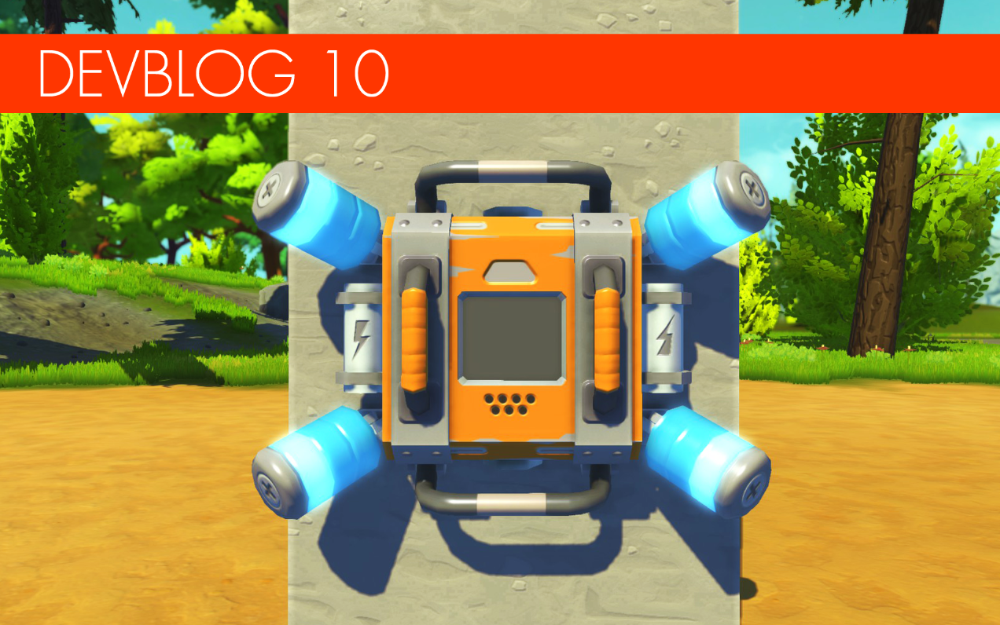
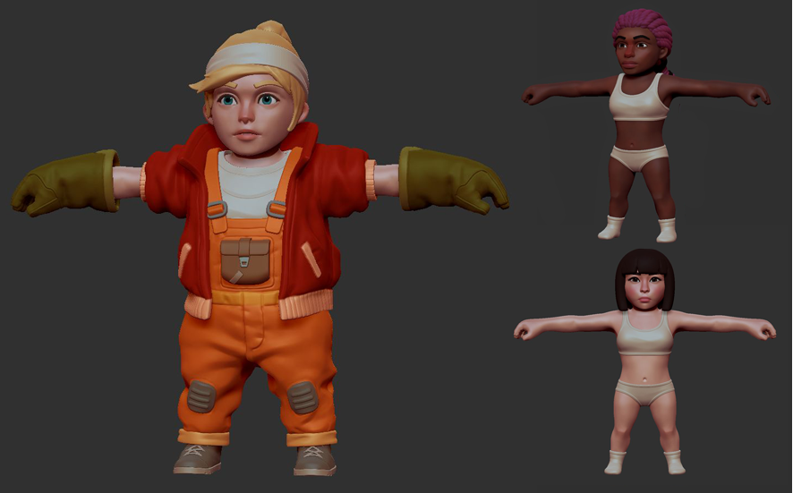
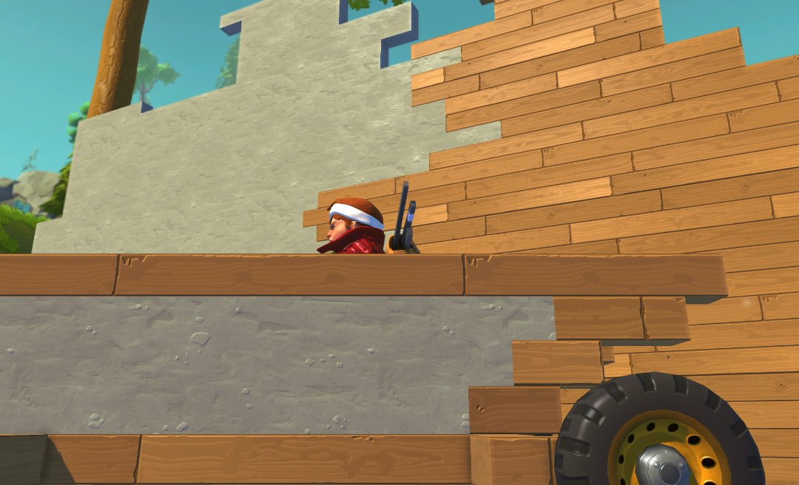
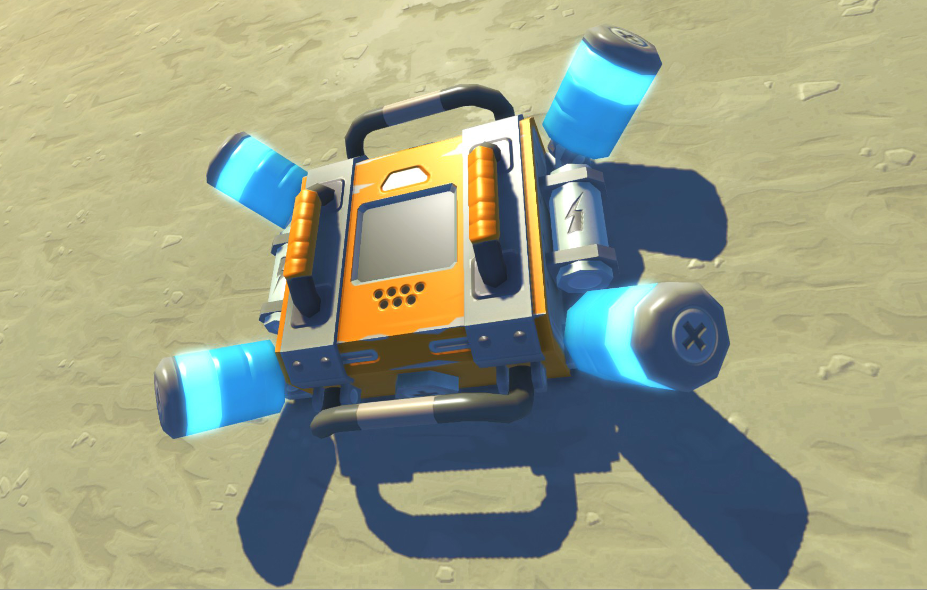
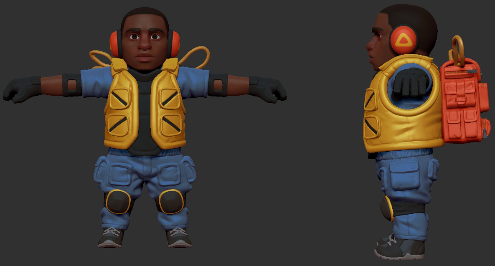
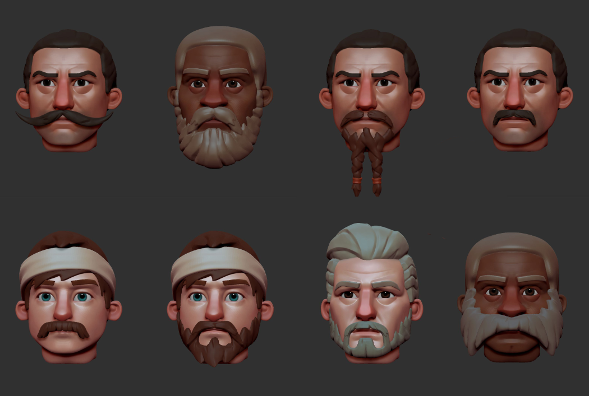
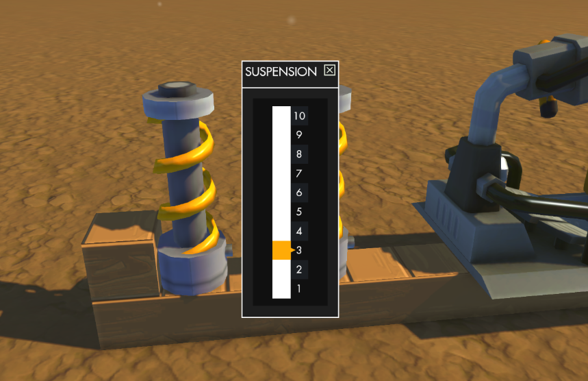

<head>
    <meta name="twitter:card" content="summary_large_image" />
</head>

**Hi Mechanics!**

How about we open up our window and let you grab another little glimpse into our
magical workshop of delights? That's right friends, it's time for another
delicious devblog!

<!--truncate-->

The last month at Scrap HQ has been a busy one, so get comfy in your driver's
seat and let's jump into one of our most epic devblogs yet! Now you're strapped
in, let's just take a quick moment to say a massive thank-you to all you
Mechanics who've been helping us test our new game engine. Your bug reporting
skills have been invaluable, thanks **so much!**

---

### Engine Update

We've started testing the new engine on a public test branch, and your feedback
has been fantastic! Heaps of Mechanics have been reporting improvements in their
FPS and players who couldn't start the game before are now all up in there,
scrapping away like champions. This makes us very, very happy! We want to make
sure we're all up front and transparent with you about our hopes and priorities
for the engine. First up, we want to make sure the game works for the players
who've so far been unable to play without issues. After that, we'll be working
towards improving FPS and and making sure the physics run more smoothly which is
work that we'll continue smashing away at up to and beyond release of the
engine. We really want you to keep all of this in mind: just because the
engine's released doesn't mean we're completely done with optimizations. You
guys deserve all the tricks we've got up our sleeve, not just one or two! Some
of you will have noticed that we get a sneaky weekly update out into the test
branch with fixes and improvements, and that should carry on happening right up
until the official release in the coming weeks. We're working as quickly as we
can, and aim to keep on improving after the release.

---

<!-- This said "Machanic" instead of "Mechanic"????-->

### Female Mechanic

   In the
[last devblog, we promised a redesign of our female Mechanic](/news/devblog-9#introducing-character-customization)
and here she is! We've made a ton of new faces and hairstyles, and here's your
first look at a few examples that we hope you'll like. Really looking forward to
getting her into the game when Survival Mode's ready.

---

### Updated Textures!

   As we beaver away in the background, cleaning up and
improving the code in Scrap Mechanic, we're also working hard to improve a whole
bunch of visuals. Since release, the block textures have been really small,
making it tough for us to make a texture that both looks great and doesn't tile
too obviously. Thanks to the glory and magnificence of our new game engine, we
can get the block textures bigger, meaning there's more working room for us to
make them all look incredible. The new textures are also way more in line with
the ambitions we have for the quality of visuals on offer in Survival Mode. Here
is a first look at the new wood and concrete textures! All of our block textures
will be getting the nips, tucks and full-on facelifts they so richly deserve, so
get ready to see your creations looking a whole lot more awesome in the near
future!

---

### Encrypt Your Connections

   While you're exploring buildings in Survival Mode,
the temptation will definitely be there for you to whip out your connect tool
and examine where all the interactive parts are located so you can get your
scavenge on. One upcoming spanner in those particular works is gonna be the
**encryptor**. This device will hide all of the connection wires until it's
removed from the structure on which it's placed. Mechanics will of course be
able to place and hide this device on their creations so that you can make life
harder for any mischievous Mechanics, protecting yourself from those who are out
to fiddle with your connections and snaffle your stuff.

---

### Survival Outfits

   Oh me, oh my! More Survival Mode goodness! Right
now, we're working on a range of alternate outfits that Mechanics can stumble
upon in Survival Mode. We want to keep these sweet styles a secret until
release, but the Farmbots have said it's ok to give you a sneak peek of this
one. Naturally, gloves, jackets, pants and other items are all separately
interchangeable giving all you fashion-conscious Mechanics a whole bunch of ways
to express your style! Exciting times for personalization fans, right?

---

### More Beards & Hairstyles

   As the ancient saying goes, with great beard comes great
responsibility. You're now gonna have the chance to choose just how great your
beard is with the new range of beards and hairstyles for the male Mechanic so
you can always be certain of fantastic follicles. Here are a few examples. Some
of them are hil-hair-ious.

---

### Suspension Update: You Asked, We Deliver!

   Ahh, the new engine is making all our fixes so much
smoother already, we can't tell you how happy we are about all of this! This
time, it's freeing us up to focus a bit more on showing our beloved suspension a
little extra love. Your feedback has led us to throw in a resistance slider to
the suspension function. Some creations are incredibly heavy, and do nothing but
instantly squash the suspension, so now it's possible to adjust the resistance
to handle different weights. We're also fixing up the possibility for you to be
able to add color to your suspension using the paint tool, which wasn't
previously an option.

---

### Particle Engine for the Modders!

   Our awesome programmers have put
together a brand new particle engine with a whole load of new features, meaning
we can add more particles as well as improve the current ones. Best of all,
we've made it crazy easy to use so all you modding Mechanics can make your mods
even more amazing!

---

### Survival Mode

Just a quick update! As you're reading this, we're working hard on the crafting
system and terrain. There's still a long way to go on Survival Mode because our
ambitions for this are high, and we won't be releasing anything that's half-done
with a heap of cut corners. We're aiming to make it great! Unless it's something
we can feel proud of at the same time as knowing it's something you'll all love
and enjoy, what would the point be? Progress is good though, and we will of
course share news as and when we get closer and we'll be doing our very best in
the meantime to keep you entertained with new fun updates to make your wait less
painful.

---

**That's all for this devblog, thanks so much for reading. Until next time,
Mechanics! Keep on scrapping!**
