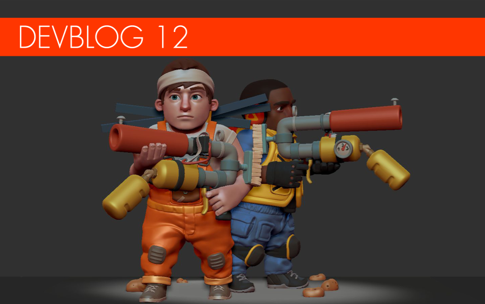

**Greetings Mechanics!**

What's that coming over the hill? Is it a dev blog? Why yes, it most certainly
is!

<!--truncate-->

Some time has passed since our last post and the team here has been extremely
busy clanking our collective hammers at some exciting new content. Our
super-powered new game engine has allowed us to accelerate forward at max speed
and we're excited to share some of the results of that added torque in this
update today!

As usual, we'd like to kick off by again thanking you, the incredible Scrap
Mechanic community, for your amazing support. We're continuously amazed to see
your fantastic creations and can't wait to see what comes next!

Now, let's take a look together at some exciting new stuff...

---

### Spud Guns!

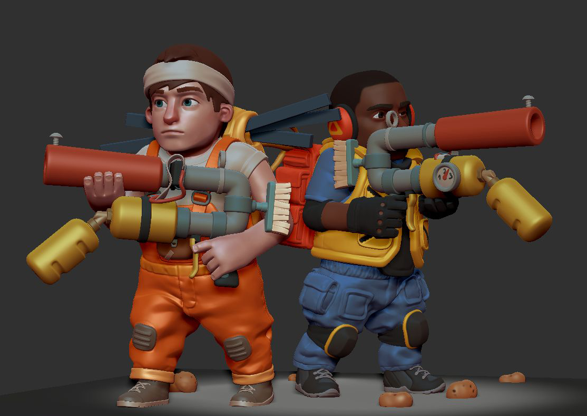 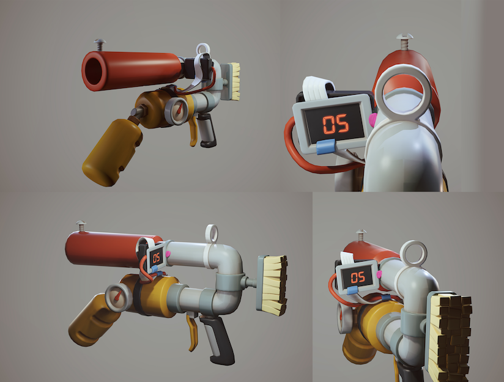 
  When things get heated in Survival Mode, Mechanics need reach no further
than the brand new, fully-loaded Spud Gun! In Survival Mode, your creations will
always be the best form of defense against those pesky farmbots. However, when
you're on foot and your creations are out of reach, the Spud Gun (aka Potato
Gun) is an exciting new tool at Mechanics' disposal. Furthermore, right know
we're testing a farming system (more on that later) where players will be able
to harvest their own ammo! This opens up a lot of new and interesting gameplay
that we're sure you'll find very a-peel-ing! We're also playing with ways of
attaching potato guns on your creations, for example on bearings. How s-mashing
is that? (We'll stop now).

---

### Massive Warehouses!

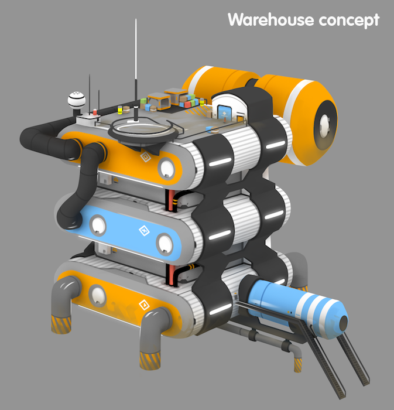 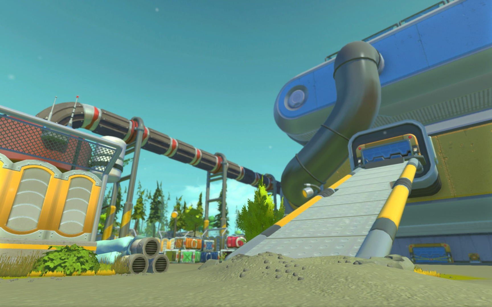 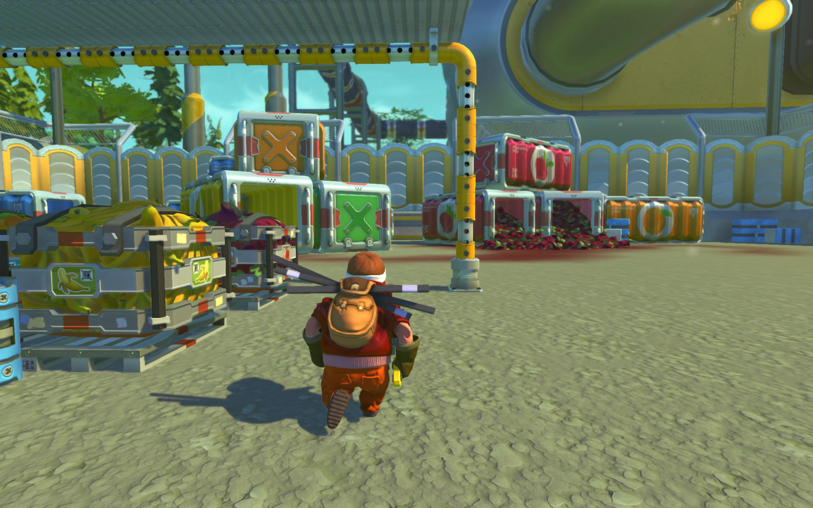 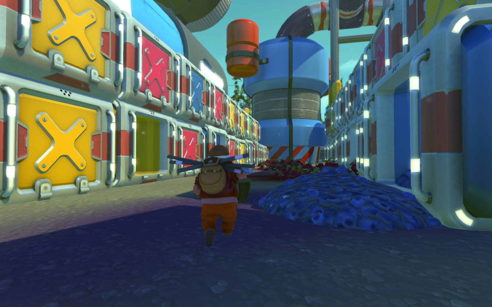 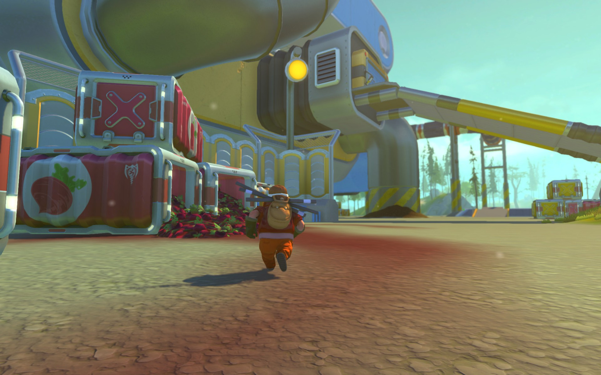
  If there's a more exciting wording pair than, 'massive warehouse', us
Mechanics sure don't know about it! When we first started work on buildings for
Survival Mode, our plan was to construct them out of building parts and to do
our best to ensure that they were absolutely as huge as possible. During the
process of creating these buildings we discovered that in order to make them as
large as we originally imagined, it meant we wouldn't be able to introduce them
with destructible exteriors due to technical limitations. Ultimately, this
seemed like a fair compromise to achieve our main ambitions and we discovered
that the decision actually enabled a lot of fun and tense gameplay! Inside these
buildings, players no longer have the option of escaping through a hole in the
wall when things go sour! To be clear, everything inside the warehouse can still
be destroyed. We absolutely intend to have fully destructible building exteriors
in the game, but on a slightly smaller scale. In the meantime, we hope you enjoy
the different gameplay these larger buildings introduce!

---

### The Sound of Survival!

As many of you will know, here at Scrap Mechanic HQ we are currently very
focussed on fleshing out and improving Survival Mode. One of the things we
really wanted to enhance was the mood when exploring the Survival world. This
was obviously less of a priority when experimenting in Creative mode, but in
Survival we really wanted the music to play a larger role in creating a deeper
atmosphere for players. Today we're delighted to share a snippet of one of the
Survival night tunes, which we hope will evoke a feeling of loneliness and
isolation. Spooky!

[LISTEN HERE](https://soundcloud.com/axolotgames/scrap-mechanic-night-time-teaser)

---

### New Animation!

   
With new features comes new animation! Since the last dev blog we've been
quietly working on fresh animations to improve the quality of Survival Mode.
Included in our list of revamps is the completely rebuilt crouch walk animation,
a revamped hammer swing animation and an awesome new sprint, which you can see
above. Much better than the old 'fast walk', right?

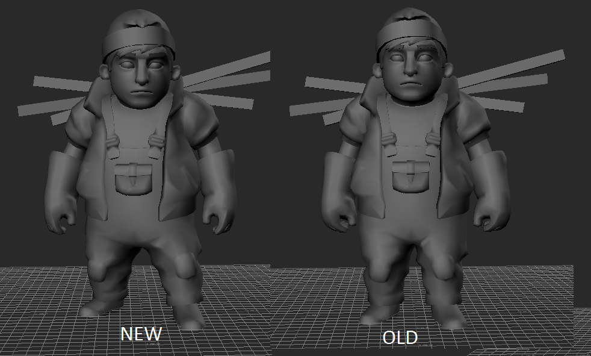

As you can see, we also changed the standing pose to a slightly more heroic
stance. Inspiring stuff, we're sure you'll agree!

Oh! and we will let this one be a hint.

---

### Crafting System!

It took some time to get the Scrap Mechanic crafting system exactly how we
wanted, but we're delighted to announce that it's finally in a place we're
really happy with! It was very important to us that our take on this mechnaic
wasn't just your regular loading bar crafting system. We wanted it to enable
creativity where Mechanics could automate crafting chains and build their own
crafting factories. We hope our Crafting System will be something a lot of you
mechanics will really appreciate and use to light your creative spark. It's only
code right now, but we should have some visuals to show you by the time the next
dev blog rolls around. We're very excited!

---

### Exo-Suit!

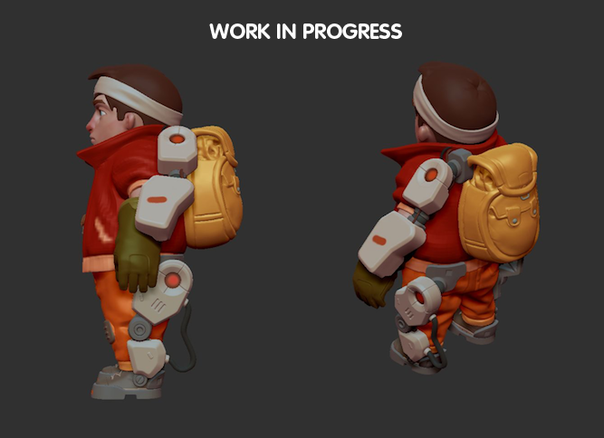   Since the Mechanic is stranded on a farming planet, it
makes sense that he'd wear an Exo-Suit, right? Well that's what we were
thinking, anyway, and so we went ahead and built a cool new outfit that will
enable all kinds of fun improvements for player movement. We won't get into too
much detail at the moment, since we're still experimenting, but the general
concept behind the Exo-Suit is to offer small perks such as a higher jump,
increased armour or the ability to demolish scrap faster. What do you think? Let
us know!

And speaking of suits...

---

### New Outfits!

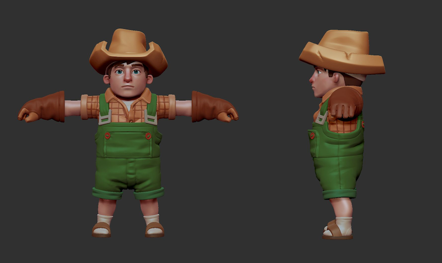   What would a Scrap Mechanic devblog be without
showing off a new set of threads for players to don? As many of you know,
alongside Survival Mode we will be adding outfits for the new character
customization feature; Hats, gloves, shoes and shirts can all be mixed and
matched separately! We are super stoked to get this in to your hands (and on to
your bodies) when Survival comes out. We've also made a ton of cringey t-shirts,
which is just how we like 'em!

---

### Wildlife!

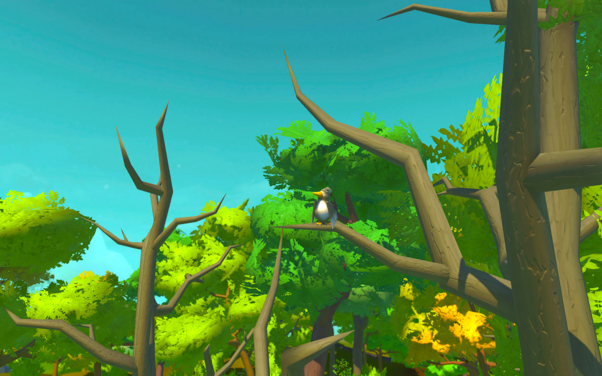    God's
beautiful creatures are about to invade the Survival world! Take our word for
it: It really does make the environment feel more alive when mischievous birds
flutter around and interact with your creations. It's perhaps not the most
important feature in the game, but hopefully you'll agree these new critters add
a meaningful layer of detail to the world. And if you disagree, you can always
smack them with your hammer... Though we don't condone that.

---

### When is Survival coming out?

When we released Scrap Mechanic we put the foundations in place. Now we're
busily crafting the gameplay systems and features that will hopefully make our
game an even more satisfying and unique experience for fans. Because we're
determined to hit those quality goals, nailing down an exact release date for
Survival Mode feels premature right now, but rest assured that we'll put it in
your hands as soon as possible, once we're satisfied that it's up to our
standards. We know a lot of Mechanics don't like to wait, but we're confident
you'll be pleased with the results when you finally get to experience them for
yourselves. Hang in there! It will be worth the wait.

**Phew. And that's it for this time mechanics! Thanks for all the love and
support and see you next time! We also have a really exciting announcement coming
soon!**

**Stay tuned mechanics!**
