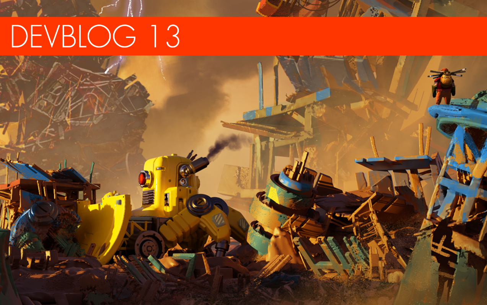

**Greetings Mechanics!**

It's been a little while since we last parked our construction diggers to
publish a devblog, but we intend to step things up a gear in future starting
with this, the first in a revamped and pollution-free series of updates, intended
to keep you even more up to date with developments and community trends in the
world of Scrap Mechanic!

<!--truncate-->

Today's update includes exciting new details on Survival Mode, reworked guns and
how terrain will work in future versions. Read on for the details - and thanks
for playing!

---

### Enter the Scrapyard

 
   Say hello to the massive Scrapyard
biome we've been building for Survival Mode! Once the largest farming settlement
on the entire planet, the Scrapyard has since been choked by untold tons of
scrap and garbage that has accumulated. With enormous bots pushing rubble around
and stacking scrap in sky high pillars of junk, the Scrapyard will be a great
place for scavenging parts and resources. But be alert... It's also not very
safe!

---

### Adjust Your Arsenal

   
In our last dev blog we showed off the Spud Gun for the very first time. Since
then we've had a ton of great feedback from the community, including many
requests for our latest firepower feature; modular weapons! We're happy to
confirm that the team is currently reworking spud guns so that players can
personalize and improve them from many different parts (see a few below!) We are
also tweaking the trajectory of potatoes based on your feedback. Should they
have a range limit? How much falloff should they have? Let us know what you
think in the comments!

---

### Survival mode terrain

 
   The next in-development tech is
something we're especially excited to share: randomly generated terrain for
Survival Mode! In Survival Mode, the entire terrain will be built from tiles
made in our terrain editor, similar to Creative Mode. However, we've improved
the system further to give more shape and curve to tiles, which we hope will
give Survival a much more epic feel, with rolling and natural-looking
environments. Thanks to randomly generated terrain, in Survival Mode players
will explore beautiful worlds unique to their experience. We can't wait for you
to explore them yourself! Keep in mind that this is just a tech demo and not how
the actual final terrain will look. It will have a lot more variation and cool
places to explore.

---

### Tile Styles

   Recently we had to take a short break
from working on the game's Terrain Editor, but we're happy to confirm that the
team is back to work on a new version that you mechanics will be able to use to
create your own world tiles! When the new Terrain Editor is released, players
will be able to place trees, rocks, roads and shape the ground itself! We're
also planning to include a feature that will allow you to select placement of
your tiles when you start a new world. Finally, mechanics will be able to share
their world tiles via Steam Workshop. We hope to have all of these features out
in time for the new year!

---

### LODs Better

In visual spit 'n' polish news, we finally got around to improving our level of
detail system to make it run a lot smoother. In the current game you might have
noticed that trees and rocks can pop as you get closer to them - this is because
more detailed models are getting spawned in. In future versions, we've made the
transition between models nearly unnoticeable, making walking and driving a much
nicer experience.

---

### Tee-riffic

   Finally, it's always a pleasure to
share some of the outfits our digital tailors have been busily sowing together.
This one is the new golfer outfit: very fitting for when you and your friends
are swinging sledgehammers at loose objects.

---

### So, Survival Mode... When?

The Scrap Mechanic team is working tirelessly to deliver a game mode that lives
up to our quality standards - and your expectations! Until we're able to hit
those goals, we appreciate the patience and support of the community. It will be
worth it in the end! Because the game is built using our own game engine, it
means we have to work a little bit harder to get the features we want working
in-game, compared to a pre-made engine which comes with functions already in
place. However, this also means we have full control over everything we do,
which is very important for a complex game like Scrap Mechanic. We are able to
build a lot of complex and unique functions that we believe fans will really
appreciate. Survival Mode, for example, will be fully moddable, on top of the
deep physics and multiplayer elements you can already see at work today.

We have an awesome team that is making amazing progress every day, working hard
to create a unique gaming experience that you will hopefully love for many years
to come. Thanks for your support mechanics!

**Until next time! Keep on scrapping!**
