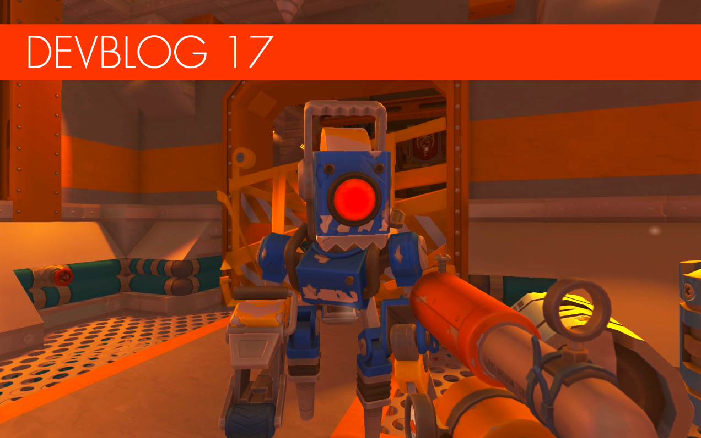

**Greetings Mechanics!**

Set your thrusters to max, because there's a fully-armed and operational devblog
coming your way!

<!--truncate-->

First, we'd like to acknowledge the amazing content coming from the Challenge
Builder community. Some of the concoctions you've come up with have truly blown
us away. For example, we really didn't expect Challenge Mode to be used to build
escape rooms and parkour challenges: those are the sort of surprises that make
the long hours building Challenge Mode really worthwhile for us. There are some
impressive challenges up on the workshop right now, made by the awesome Scrap
Mechanic community. We really encourage everyone to go
[HERE](https://steamcommunity.com/app/387990/workshop/) and try some of them!
Anyway, we know you're here for some Survival news, and we are ready to deliver!
Onwards...

---

### Survival, piece by piece!

Let's start with the necessary but less fun background stuff that we've been
working on. When developing a game, it's common to build features and segments
separately that eventually must be pieced together. For Survival, we're now
starting to weld these elements in to one. For example, a seamless transition
from the open world into a warehouse, or loading in rooms at the right time and
other related optimizations. This has taken a lot of our time these last months
and there is still some "knitting" left to do. But it's really exciting to see
these elements finally come together for a more cohesive survival experience.

---

### Tapebots are Tough!

 
   
The Tapebots are coming closer! We're currently tweaking their behavior to make
sure they're as satisfying as possible to battle. We really want Mechanics to
respect the enemies in Scrap Mechanic. The Tapebots will be very dangerous and
the players will need to be tactical, creative and show quick reflexes in order
to deal with them. We hope that this less forgiving approach to difficulty will
make situations more tense and exciting, as well as a lot more fun in co-op
where you and your friends really can work together to take enemies down. So,
don't go running into the warehouses spraying and praying... you'll only end up
knocked out next to all the great loot!

---

### Upgrade Parts and Components!

 
   In the past weeks we've been teasing
some of the new upgradeable interactive parts on our Twitter. Now you can see
them in full 3D glory! Basically, we are working on letting Mechanics upgrade
the interactive parts in Survival. These upgrades will allow things like more
connections, faster speed, less gas consumption and more! The sounds will also
change from level to level. The way you will upgrade these parts is with the new
Component Kit found when exploring the world. This new consumable will be highly
sought after and something a lot of Mechanics will look for.

---

### A Big Lift

   
When we started working on Scrap Mechanic, the lift was only for lifting stuff.
But during development the lift had more functions added and overall became more
useful, for stuff such as spawning blueprints and a few more new functions
coming for Survival. To match these new features, we've redesigned the lift to
fit its uses visually. But on top of that we're also adding a cool new lift
remote that the Mechanic will pull up when using the lift. We also might let
Mechanics put different cool charms on their remote. We'll see!

---

### Dress Up

 
 
   After much toil, we've finally got
character customization up and running the way we wanted. It really is a bit of
a shock (in a good way) to see our Mechanic in so many different outfits
suddenly, running around in the game. We're sure you'll agree it's a lot of fun
to style your mechanic and really make him your own. It was a lot of work, but
we think it was worth it. Not only will you try to hunt down useful parts in
Survival but also cosmetics to unlock that you can impress your Mechanic friends
with. Here are some in-game shots!

---

### Pack Attack

 
 
   Say hello to Packing Stations! One
way to accomplish farmer quests in Scrap Mechanic will be to load up these
mobile fruit and vegetable houses, thus making the produce ready for delivery to
the farmer hideouts. All Mechanics need to do is drive up to the correct socket
and then fill it up until it spits out a packaged crate. But have your lifting
creations ready, because they need to be stacked and transported!

---

### Visual Spit 'n' Polish

The eagle eyed among you will notice that we're really pushing the graphics in
Scrap Mechanic these days. We want to make sure that by the time Survival comes
out, the game as a whole will be a much more visually appealing and moody
experience. So here are a few new visual details.

Dynamic lights will now both cast shadows and even take color into account. We
have to be careful with this one, since it's expensive. But we think we can
optimize it enough to run well! Here's an example.

We've also gone back and updated a lot of the old parts to make sure they fit
the new updated Scrap Mechanic visual style. They really came out nicely! Let's
see if you can spot the improvements...

 

Since metal is something that we have a lot of in Scrap Mechanic, we've also
updated that to allow parts to have a nice shiny chrome effect!

---

Thanks for your support - and for playing! We will be back soon with more Scrap
Mechanic news!
