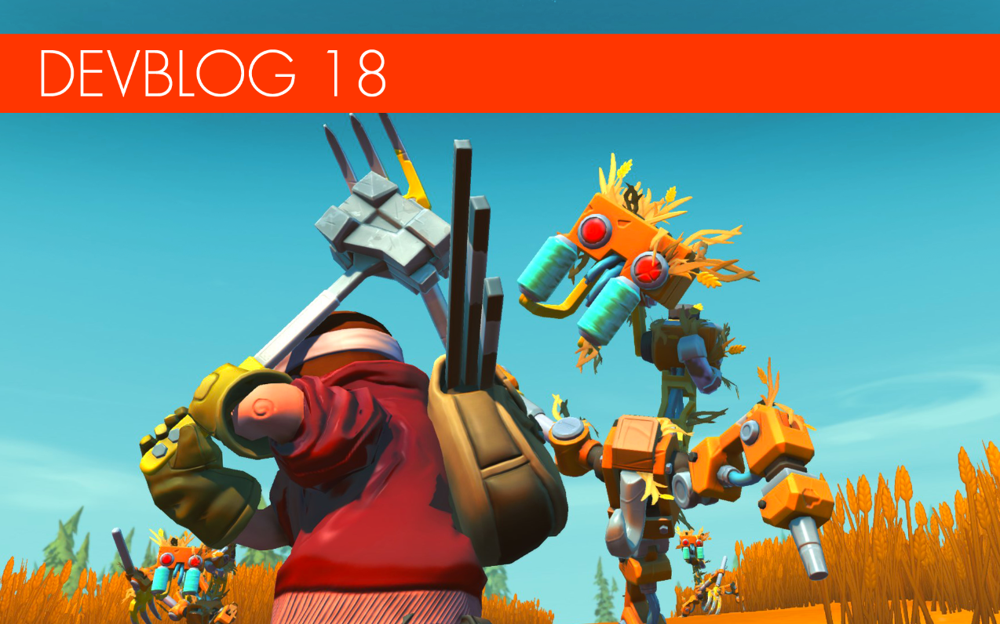

<head>
    <meta name="twitter:card" content="summary_large_image" />
</head>

**Hi Mechanics!**

It's that time again! when we take you on a trip down development lane to show
you some of the new exciting things that we've been working on at the Scrap
Mechanic HQ.

<!--truncate-->

All our time is dedicated to survival mode at the moment with a lot of new
things getting added daily. We've also been collecting a lot of optimization
requests and feedback from the community. There is still a lot we can do to make
your crazy and more complex creations run even better. We plan to do a proper
optimization update later when we can free up some more time. Just a small
update on that. With that said, let's move on to what you mechanics are here
for: A nice big update on survival development!

---

### Haybots gone haywire!

 
 
   You might recognize parts of this new
farmbot from our teaser tweet last week. We are super excited to introduce you
to the Haybot for the first time! But don't get too close unprepared since they
are very unreliable and dangerous. Originally made to make haystacks and package
them in plastic wrap, these Haybots have gone out of control. Now they're often
found doing nonsensical things in ruins, like tearing them down and filling them
with hay. The Haybot would best be described as the "Zombie" of Farmbots.

---

### New survival music

Our amazing musician Zhea has been working on a lot of new tracks for survival.
Since the game has a lot of exploration and building, A lot of the music is
beautiful, moody and atmospheric. However, today we like to share a snippet from
when things intensify in Survival. Potatoes fired! Take cover!

Check it out [HERE](https://soundcloud.com/axolotgames/spud-fight-teaser)

---

### Big menu redesign!

 
   
We did a little tease of the inventory redesign previously. The feedback that we
received from you was fantastic and helped us direct the redesign more to the
communities liking. Here is an update on some of the new changes. Please keep in
mind that this is still not set in stone and we are still trying out new things.
But please let us know what you think of this redesign above.

---

### Multitool

   
Introducing the new multitool! Or maybe more accurately described as the
refinery handtool. it's lucky that all mechanics came equipped with one. Very
handy in survival situations if your maintenance ship crashes and you're
stranded. A lifesaver when it comes to refining wood, farmbot legs and stone
into blocks. However, it's a bit slow. So upgrading to a Refinebot would be more
efficient for sure.

---

### The crash!

 
   We were not sure whether we should
keep this crash site a secret for its release... After all, it's where you start
in Survival mode. But we changed our mind. You mechanics need to see more of the
cool things we've been working on so here goes! Including some early concepts.
We don't want to spoil too much, so let's leave it at that.

---

### Crates with loot

   Scattered around the map, mechanics
will find these smash-able crates! We are still not sure who scattered them
around the planet. They might have fallen from a cargo ship? It's still a
mystery to be resolved. However! They do contain some good items at times so
they are totally worth to smash and have a look inside. Who knows! you could be
lucky!

---

### Cookbot concept!

   The Cookbot is a new addition to the
helping bots that the Mechanic can craft. This master chef will take your
ingredients and make the most delicious dishes! Just absolutely yummy! Some are
even so good that they can revive a fallen mechanic in multiplayer. But it will
cost you some adventuring and harvesting to help the Cookbot put it all
together.

### Random fun stuff!

Let's close it off with some smaller but fun random things that you might enjoy.

 

Our crazy Totebots now have a final animation in place. Do they look scary
enough?

We also did some updates to our engine and added a nice translucency when the
sun hits the trees and bushes.

Also! more work has been done on the dynamic lights and shadow casting. Here is
an updated gif.

---

Lastly, we want to say a big thanks to all the amazing support and patience from
you mechanics. We are speeding the survival development up as much as we can
without compromising on quality. We hope you agree that it's the right decision.

We will be back soon with more news!
