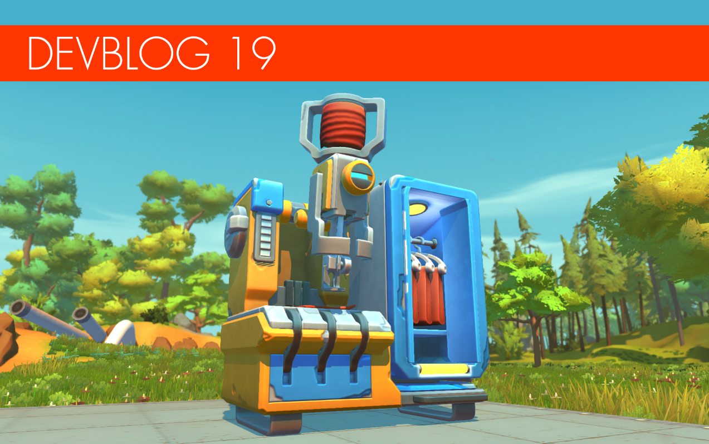

<head>
    <meta name="twitter:card" content="summary_large_image" />
</head>

**Hi Mechanics!**

It's been another great month at the Scrap Mechanic HQ. Our team has been
working hard! We have plenty of awesomeness to show you!

<!--truncate-->

Before we get on the road and take you to some of the cool new stuff we've lined
up today, we have a small update on Survival Mode's release timing. We do not
have a date yet. Stepping back and looking at all the tremendous work our team
has done on Survival so far, it's clear that this mode has far outgrown our
initial ambitions and evolved into something that itself represents a gigantic
upgrade on the entire Scrap Mechanic game. There are tons of new content and
features, hundreds of new building parts and blocks, a completely new open world
environment with enemies and places to explore, a big graphical upgrade as well
as optimizations and much, much more. Sometimes we joke that this is basically
Scrap Mechanic 2 at the office!

We know you've been waiting very patiently for information on when you'll be
able to get your hands on and play Survival Mode for yourselves, and we promise
that we are doing all we can to get there as soon as possible. Right now, the
honest assessment is that it's still too soon for us to commit to a hard
deadline when we're still iterating on the final pieces of Survival. It's
difficult to estimate the time required to tweak and balance all the things that
we want to get right. However, we hope that this Devblog gives you some
reassurance that we are going in the right direction and things are looking
good. Hang in there a bit more Mechanics!

---

### New Dressbot!

 
   Straighten your tie and prepare to
meet the newest addition to the crafting family, the awesome Dressbot!\
During your adventures you will come across mystery boxes with clothing that you
can take back to the Dressbot to craft and add to your wardrobe. However, in
order to adjust your look the metal tailor will require cotton from cotton
plants that you will discover around the world. All clothing that you craft and
unlock will be available to use across worlds and other game modes. You can even
change clothing at any time from the main menu, as well as in game by using the
Dressbot's wardrobe!

---

### Base defense!

 
 
   We've previously shown you some brief
combat GIFs on our Twitter account, but you guys really don't know what's in
store. What makes combat in Scrap Mechanic so interesting is the creative aspect
and finding creative solutions that will help you survive. For example, many
players will build a static or moving base to store their resources and items.
However, when Farmbots find your hideout, you'd better have your traps and
defensive solutions in place, otherwise it's going to be a very short game.
Today we are showing the Haybots in action for the first time and a playerbase
under attack!  Oh! And if someone was
thinking they will camp up on a lift. That will not work. Bots will pull you
down.......

---

### Glow-worm to glowstick!

 
 
   
Introducing our new wildlife addition, the glow-worm! This little guy is
harmless and can be picked up and placed down anywhere in your base, making it
pretty much the perfect pet. Even better, these guys can help you craft
glowsticks, which come in multiple colors. You can also craft your own signature
color when playing with other Mechanics. Oh, and they absolutely love to munch
on cardboard blocks! We still need a name for these glow-worms so help us with
some name suggestions below.

---

### Open world progress!

 
   Another aspect of Survival Mode we
know you're desperate to see more of is the world itself and how it works. As
we've mentioned previously, the whole world is built out of pre-made tiles that
are skewed, creating a seamless, varied environment that is completely random,
but at the same time beautiful and fun to explore. We are really happy about how
this all came together. What's also new since the last time we showed you the
world is our system that can draw a lot of physical items on screen at the same
time, making it possible for us to have around 3,000 trees and rocks visible at
once. It really makes the world a lot more immersive and for those of you with a
bit older PCs, don't worry: we've spent a lot of extra time optimizing to ensure
it runs well on all kinds of hardware. This world has a few new biomes that are
not included in the GIFs, but we will show them in a later Devblog for sure.

---
### Welcome to the Propane Station!
 
 
   
Well, at least it's what we call it at the moment. It's time for us to reveal a
new location... and careful, this one's explosive! The Propane Station is a
highly volatile area previously used to create explosives to dig out mines on
the planet. These locations are now abandoned and even better, house some very
aggressive Totebots. It's a high risk, high reward type of place, great for
finding explosives and gasoline and other useful items. Just watch where you
step, Mechanics...

---
### Cookbot and food!
 
   
Is anyone else feeling hungry? Then you'll enjoy our next invention... In our
[last Devblog](/news/devblog-18#cookbot-concept) we showed you some early
concepts of the Cookbot - and here he is in the game! This amazing mechanical
cook will help you whip up tasty food in no time, which will in turn help keep
your health up and also the health of any friends who might need a revive. We're
sure you can't wait to sink your teeth into every Scrap Mechanic's favorite
food, a delicious pizza burger!

---
### Fantastic Farming!
    
Farming is one of the features that we're still polishing up here at Scrap
Mechanic HQ and putting a lot of attention on. When we have everything in place,
we promise we'll show you a detailed overview of where we've got with this
feature. But for now, here are some work in progress images to give you some
idea of how it looks!

---

That's it for this time! Time for us to get back to all the iteration work.
Connecting and balancing the survival mode. There is a lot more cooking so we
will be back soon with more exciting survival news!

