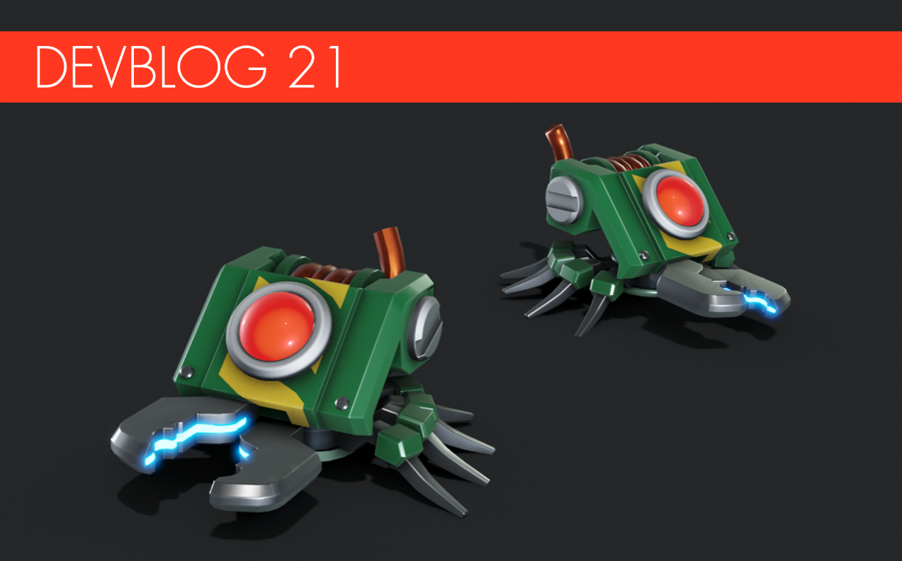

**Calling all mechanics!**

New devblog, coming through! This time, we want to focus on a few things that
are coming up in the not-too-distant future and also show a few new things that
are in the works for the next survival chapter.

<!--truncate-->

---

### Cablebot

   
Watch out! There are more bots incoming in the next chapter: While traveling
deep underground, you might encounter the cablebots: they travel in big numbers
and love digging holes with their cable clippers. No one knows why the cablebots
are that deep in the first place yet; perhaps you will find the answer to this
mystery in a future update. Until then, you had best prep some chests with
potatoes and dust off that spudgun; you're going to need it.

---

### Quest are coming

   Progress on the new quest system for
the next chapter is moving along. The quests in the chapter will guide you
through the story while letting you continue playing at your own pace. We will
also be adding a dialogue system to the game, letting NPCs talk to you! We love
how it feels and where it's heading. Here is an image of the player taking an
incoming call.

---

### Digital clock

   
We have started work on a new interactive part. The next chapter will introduce
a clock, so mechanics can check the time, anytime, whether they're driving or at
their base. But that's not the best part about it: the clock will also allow the
mechanic to set a specific time for it to interact with a trigger. Thanks to it,
you should be able to set a time for your base defenses to turn on or off, so
you can keep those uninvited nighttime visitors away!

---

### Creative mode update

 
   
In the Creative Mode update that's just around the corner, we will be updating
the terrain to include the same props as the world of Survival Mode. You will
now be able to cut down trees and test out new ideas for lumber- or rock
drilling-based creations. We also added water to some of the tiles, as well as a
water border around the creative terrain world, so you can go on boat races with
your friends! We also updated the flat world ground texture, since the old one
was a bit out of date against the game's new visuals. We have also slightly
increased the map size of both the terrain as well as flat world. You will have
to create a new world to get the updated terrain however. The new props and
water will not show up in old worlds.

---

### Decorate the main menu

   
Some mechanics might have been wondering about that odd background platform that
is sitting in the middle of the main menu. We're finally putting it to its
intended, original use: mechanics will now be able to enter that world so they
can build and decorate their main menu, simply by clicking the blue pen icon at
the bottom. Let's make some neat pixel art!

---

### Enemy capsules

   
We've only given you sneak peeks at the enemy capsules for creative mode on our
Twitter so here's another good look at them in action. Use them to test your new
traps and defenses against bots before your next survival mode session. But
that's not all; we're also working on adding another feature to the enemy
capsules: paint jobs. Now, you can paint bots in different colors, so they turn
on each other instead. For example: if you spawn two tape bots and paint one
yellow and the other pink, they'll duke it out instead of coming after you!
Lastly! Wocs and glowbugs will also get a capsule. The capsules will come with
the new creative mode update.

---

### Interactive tutorial part

   
Calling all new mechanics! Learning how to build a vehicle the first time you
start the game can be a bit hard, especially when you've got nothing but the
handbook. The new tutorial block is here to help you flatten that learning
curve! Now, you can get step by step instructions on how to build a basic
vehicle and grasp the game's building fundamentals, simply by placing it on a
lift. We are still not sure if this one will come out before or with the next
chapter.

---

That's all for now!

We have some truly cool stuff in the works that we will show in
[devblog 22](/news/devblog-22), so please keep an eye out for it. It's something
we know a lot of you mechanics will love.
