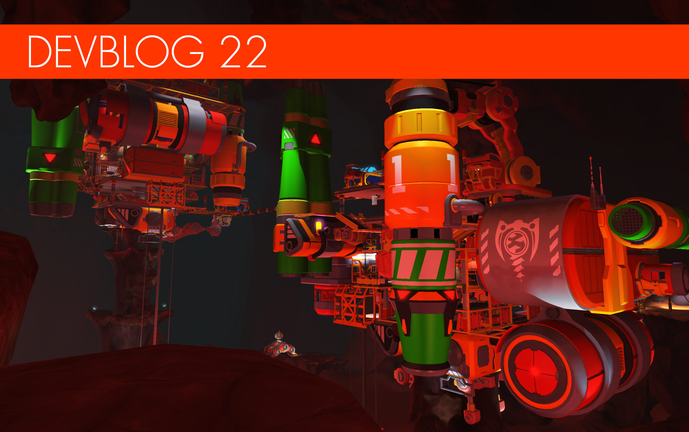

<head>
    <meta name="twitter:card" content="summary_large_image" />
</head>

**Hi Mechanics!**

It's that special time again when we open up and show off some of the content
we've been working on at the Scrap Mechanic HQ. This is probably one of the most
exciting devblogs we've done in a while, as we will be showing off our new
digging system! We're sorry for the long wait, but the features in this devblog
have been in the making for a while. We've also been working on a lot of
story-related things that we don't want to spoil for you, so we won't reveal
everything just yet!

<!--truncate-->

So let's crack open a sunshake and dig in!

---

### Underground digging and exploration

 
 
 
 
 
   The new chapter will come with a
brand new island, housing a huge, collapsed mine and a massive mystery. The new
location that you will get to explore will contain a lot of new content and
underground biomes. Once in it, you will have to create a mining vehicle and
start digging for resources while uncovering small and large cave systems. Some
parts of the mines will require special types of drills to get past. In some
cases, explosives will be needed. We put a lot of work into making vehicle
digging into a fun and creative experience! Here are a few shots showing
underground digging and exploration in action for the first time. You can also
get a first glimpse of a very dangerous place: the underground station. Keep in
mind that these shots don't have the correct lighting and particles yet;
everything will look better in the final version.

---

### Sticky Wheels Update

 
 
   Here is a little update on the Sticky
Wheels we've shown previously. We really love how they turned out! They work
really well and have a nice, gooey look when you drive. You will definitely need
these when digging in the mine. They will most likely have a pink/purple-colored
goo by default instead of the yellow/green shown in the GIFs. We are also
looking into letting you paint them in other colors. Currently, the Sticky
Wheels are using chemicals as a resource, but we are still testing them out, so
we can get the perfect balance between consumption and use-time.

---

### Cablebot Update

 
 
   
The Cablebots are really starting to shape up. Buried deep underground in the
collapsed mine, these clankers come in great numbers, attacking both you and
your creations on sight. Sometimes, they might latch onto your creation and
gradually eat away at it. Other times, they might simply leech off your battery
or fuel resources. You'd better slap them off your creations before they start
piling up; that's when they're going to do some real damage!

---

### Battery Generator

 
   Electric engines and other things
requiring batteries will be very useful during your time underground. And when
you're in need of batteries, there's nothing more useful than a battery
generator: simply place a battery container inside it, spin the red valve and
the battery charger will generate new batteries! You can spin manually, by
hitting the valve with the hammer. But if you'd rather save time, you can also
create a gas engine-powered arm that will spin the valve for you. We plan to
introduce more interactive parts in the future, with new, creative ways to
interact with like this one. We cant wait to see how these types of parts will
spark your creativity!

---

### Digital Signs

   We finally got around to adding
digital signs. In late-game Survival, you often end up with a lot of chests.
These signs will let you label things so that they are easier to find. Not just
that, but they can also be used to leave a message and help decorate your
creations. They come in 3 sizes, with a selection of customizable screen and
text colors!

---

### Wedge Update

   Shoutout to the wedge gang! We've got
a lot of requests about adding wedges and we are trying to find a good way of
implementing them, so here's a little update on what we have so far: The problem
has been the wedge scaling and removal in Survival. It's a different system from
the simple block scaling. But we will keep testing things out and hopefully,
we'll find a good way that works in Survival. The wedges will be included in the
next Chapter.

---

### Plasma Saw

   
Introducing the Plasma Saw: the saw that is sharp enough to go through trees
like butter and even cut through crystal rocks! But why stop there? The Plasma
Saw can also be used to boost your creations' defenses against those pesky bots.

---

### NPCs

   
The next chapter will feature a few new NPCs that you will get to interact with.
Here is a first look at two of them!

---

### Fancy Tuxedo

   New outfit time! This time, we are
taking a break from all the workwear and decided to make a stylish tuxedo
instead; just the thing for mechanics who want to adventure in style. As usual,
all parts of the tuxedo can be mixed and matched with other outfits, for even
more awesome outfit variations! Are there any other types of outfits you'd like
to see more of in Scrap Mechanic? ~~Let us know in the comments~~ (see original
steam announcement).

---

That's all for now, Mechanics! We hope that you have enjoyed looking at all the
things we've been working on. We would also like to add that we are still
looking in to ways we can improving the physics and decrease lag more.

See you in the [next Devblog](/news/devblog-23)!
